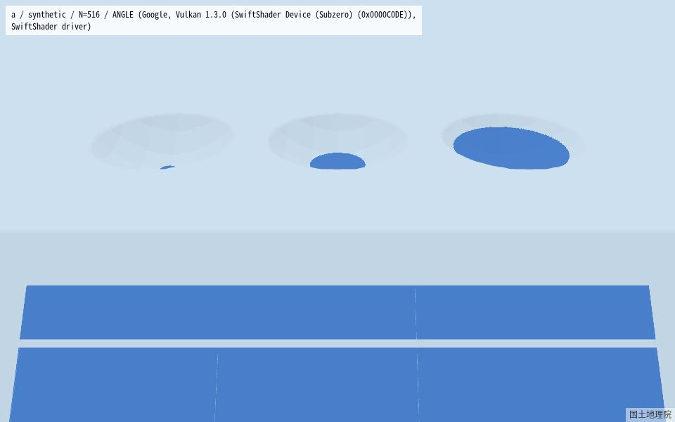
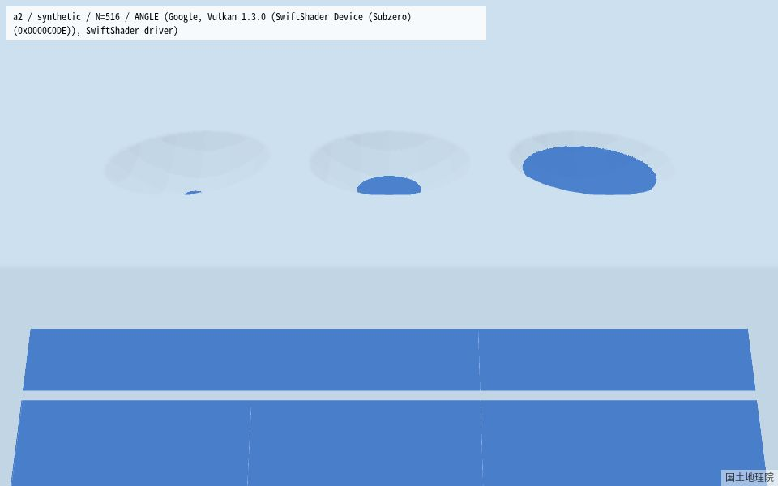
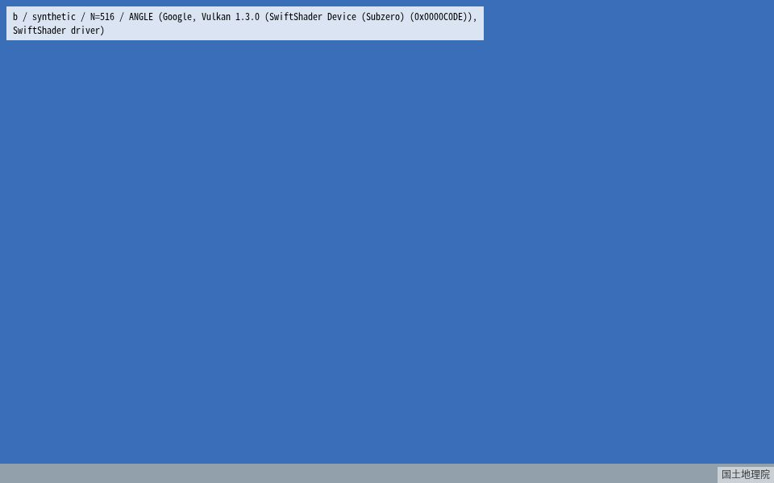
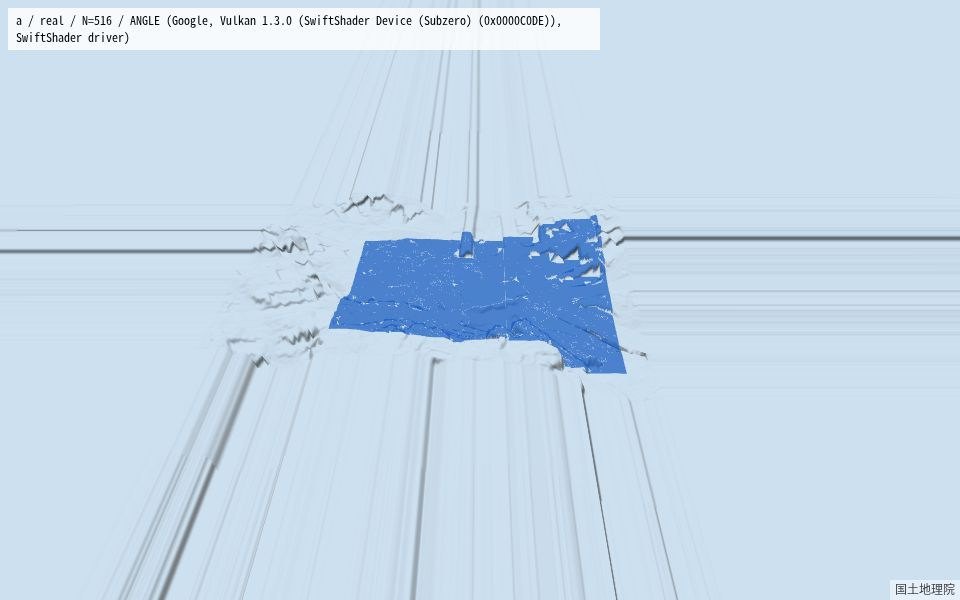
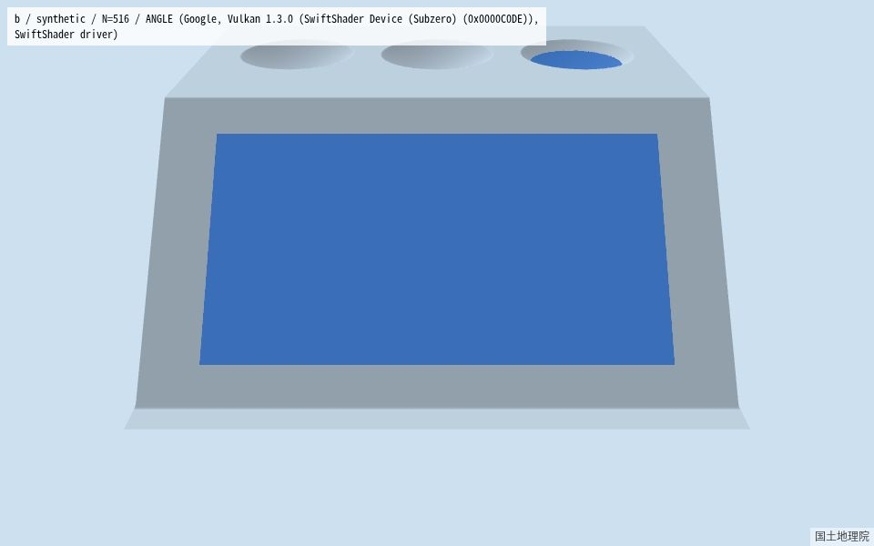

# Spike S: 3D 描画方式の比較 — 報告

- Status: 確定待ち（ユーザーの裁定）
- 日付: 2026-09-12（開始）、2026-09-13（完了）
- spec: `docs/superpowers/specs/2026-09-10-S-3d-rendering-spike-design.md`
- 計画: `docs/superpowers/plans/2026-09-12-S-3d-rendering-spike.md`
- コード: ブランチ `spike/3d-rendering`（マージしない）。結果・コードの参照はコミット H = `113d393`（https://github.com/terapyon/raintrace/tree/113d393b0b15062c1a055a2f8d76b51a52ae747b/spike 、push はユーザーが行う）

## 1. 結論

**推奨: 候補 A**（MapLibre の 3D terrain ＋ シミュレーションの標高で高さを付けた水面の Custom Layer、`polygonOffset(−1, −4)`）。**条件: 実 GPU の fps で確定**（合格基準 3 はユーザーの計測待ち。実 GPU・headless の参考値では、A は D15 の閾値の境目にある）。

理由（規則ごとの評価は §8）:
1. A は合格基準 1（平面の 1cm の膜、zfix=offset で 8/8 ○）と合格基準 2（地形と水面に同じ倍率）を満たす。曲面は、描かれる地形タイルのズーム 16 以上なら幾何の上でも沈まない。ズーム 15 以下の対策は 05 で決める（§10 の 1）
2. A 系と B 系がともに基準 1・2 を満たすので、規則 2 により A 系を採る。A 系には範囲の継ぎ目も自前の地形のコードも無い。B 系には構造上の弱点がある。B は `map.setTerrain` を呼ばないので、MapLibre はカメラを平らな地図として置き、B のメッシュは標高 × 倍率だけカメラへ迫り出す（z18 ×10 で約 200m、カメラの距離は約 437m。p85 では南の縁が 242m の壁になる）
3. A と A' では規則 3 により A を採る。A' は、表示される水面の高さがシミュレーションの標高と最大 0.024m × 倍率だけ食い違い、高さの取り直しに速い経路でも 123〜156ms かかる（上限は 50ms）。A' は 05 の候補から事実上外れる

**合格基準 3（fps）の状況**: ユーザーの計測待ち（§3 の手順、10 個の URL）。実 GPU・headless（参考。60Hz が上限）では、B・B-raw が 60.0fps・長いフレーム 0%。A は 58.0／56.8fps・0.7／2.1% で、2 視点のうち z16 ×10 p85 で D15 の閾値を超える。地形のみ（水面なし）の A も 58.0／56.2fps・0.7／2.5% とほぼ同じなので、A の不足は MapLibre の地形の経路のコストで、水面が足す render の CPU は約 0.2ms にとどまる。

**ユーザーに裁定してほしいこと**
1. **T9 の案（§9）**: A を採り、tech-spec §5.5 をこの案で改訂してよいか。裁定の後、05 の改訂（R05-3）で tech-spec §5.5 と spec 05 §4 を直す（D14）
2. **A が手動の計測で基準 3 を満たさなかった場合の方針**（今は決めない。選択肢は §8）: 規則 1 のとおり B 系に移る／A を保ち、05 で地形のコストを見込む（粗いズームは 2D にする、地形を描く範囲を狭める など）／spec S §5 の代わりの方針（3D は地形のみ、または 3D を 05 から外す）
3. **RS-2: A の水面に three を使うか**: three を使う（gzip 126.5 KB。動的 import なので初期ロードは 425.0 KB のまま、総量は 692.0 KB で上限は 1.2 MB）か、生の WebGL2 で書く（B-raw の水面の部分から見積もって約 192 行。今の three の版は 168 行。GL の状態の回避策 4 件のうち 3 件が当てはまる）か。材料は §8 の規則 4 の後

## 2. 環境

| 項目 | 値 |
|---|---|
| 起点のコミット | f199a02 |
| MapLibre GL JS | 6.6.0 |
| three | 0.185.1（@types/three 0.185.4、推移的依存 6 個: @dimforge/rapier3d-compat・@tweenjs/tween.js・@types/stats.js・@types/webxr・fflate・meshoptimizer。pnpm-lock.yaml による。開発時のみで、バンドルには入らない） |
| three の扱い | スパイクのブランチ（`spike/3d-rendering`）だけの依存。`main` には入っていない |
| 自動の計測 | Playwright 1.62.1 の Chromium、`--enable-unsafe-swiftshader`、960 × 600、deviceScaleFactor 1 |
| 本番のバンドル（スパイクの前） | 初期ロード 388.7 KB / 総量 525.0 KB（Task 9: `pnpm build && pnpm size` で確認、スパイクの後も同じ） |
| 報告が参照するコミット（H） | `113d393`（`spike/3d-rendering`。結果・コンタクトシート・コードの URL はこのハッシュで固定する。§7） |

## 3. 判定の方法

- 入力: 合成の場面（計画 D4）と、実データの場面（渋谷駅付近の DEM1A の実タイル 9 枚。`spike/fixtures/gsi/`、取得日と出典は同じ場所の README。範囲の最低・最高の標高、無効セル、満水の最大の水深は `spike/results/real-scene.md` の値を Task 1 Step 14 で写す）

**合格基準 2（1cm の膜の可視率・ちらつき）の数値の測り方（`spike/src/capture.ts`、計画 D9）**: `WaterMeasure` の 4 項目。

- `footprintPx`: 深度テストを切り、水面を不透明のマゼンタで描いたときの画素数（drawingBuffer の画素。水面のシェーダの `discard` は効くので、1cm 未満の場所は含まない）。地形に隠れているかどうかに関係ない、水面そのものの広さ
- `visibleRatio`: 深度テストを戻して同じ場所を描いたときに見えた画素数 ÷ `footprintPx`。1 に近いほど、地形に隠れず・沈んでいない
- `interiorPx`: `footprintPx` の縁を 2 画素だけ収縮（erode）した内側の画素数。縁のアンチエイリアスや 1px 単位のジャギーをちらつきと誤認しないため
- `flickerRatio`: `interiorPx` のうち、bearing を ±0.002° だけ動かした 3 枚（0・+0.002・−0.002）で見え方（見える/見えない）が変わった画素の割合。遠くの物体ほど 1px の視点移動で大きく動くので、内側だけに絞ることで「本当に不安定な z-fighting」と「画素の端の移動」を分ける

判定の閾値（計画 D9）: `visibleRatio` の最小が **0.98 以上**、かつ `flickerRatio` の最大が **1% 以下** で合格。閾値の判定に使う場面は **合成の斜面の 1cm の膜**（`water: 'film'`、`spike/e2e/matrix.spec.ts` の `plans`）——手前に遮る地物が無く、可視率が 1 未満になる理由が「z-fighting による沈み込み」しかないため。

`visibleRatio` は一方向にしか効かない指標であることに注意する: 遮蔽が正しく起きるべき場所で水面が地形を突き抜けて見えてしまうケースはこの計測では検出できない一方、遮るものが無い平面では、より強い `polygonOffset` ほど可視率が同じか高くなりやすい。したがって §4 の「offset2（−2, −8）の可視率が offset（−1, −4）よりわずかに高い」こと自体は対策の優劣を意味しない——両方とも判定 (2) に合格しており、本番には副作用の小さい弱い方（offset）を使うのが妥当な方向。

実データ（`real` の行）の値は参考値: 実際の池・満水面は周囲の地形が正当に隠す分を含む（`spike/results/water-a.md` の `real / zfix=offset` は可視率が z によっては 0.001〜0.9 台まで下がる）。ただし、この可視率の低さの内訳を地形による正当な遮蔽だけと決めつけることはできない: 無効セル周辺の水面のスライバー（§7・レビュー Important 2 参照。地中に潜っていて見えない分を含みうる）や、曲面（すり鉢）での LOD 由来の沈み込み（§4・レビュー Important 1 参照）も混じり得るため、内訳を切り分けていない参考値として扱う。

所要時間: `pnpm spike:e2e spike/e2e/matrix.spec.ts -g "matrix: a$"` は 4 分 37 秒（1 テスト）。内訳は、スクリーンショット 128 視点（64 視点 × 2 場面）× idle 1 回（`setView` の中の 1 回）と、数値の計測 4 通り × 16 視点 × idle 6 回（`setView` の 1 回 + `measureWater` の 5 回: `mask-nodepth` 1・jitter 3・`off` に戻す 1）で、128 + 64 × 6 = **512 回**の idle（見積もり 510 回とほぼ一致）。実測 277 秒 ÷ 512 ≈ **0.54 秒/idle**（想定の 0.5〜2 秒の範囲内）。20 分の締め切りに対して余裕があったため、実データの参考値の行は外さずそのまま回した。

**合格基準 3（fps）の「長いフレーム」の閾値（計画 D15、Task 8 fix round 1 で改定）**: 当初の計画 D15 は固定 33.4ms（60Hz の 2 フレーム分）を閾値としていたが、float の requestAnimationFrame の時刻はちょうど 2 フレーム分（33.3〜33.5ms）の間隔をこの閾値の内外に揺らし、同じ条件の実行で `pass` が入れ替わっていた（task review Important 3）ため、**そのランの中央値（p50Ms）の 2.5 倍**（60Hz なら約 41.7ms、120Hz なら約 20.8ms）を閾値とし、再採点できるよう `FpsResult` に中央値・閾値・粒度別のヒストグラム（`gapHistogram`）を残す形に改めた（計画のレビューの反映 R7）。

**合格基準 3 の手動の計測（ユーザー）の状況**: **ユーザーの計測待ち**（`spike/results/fps-manual.md` はまだ無い）。ユーザーに送ったのは次の「§9 改訂版」（Task 8 の fix round 1 で改めた版）。計画の Task 8 Step 6 に残っている手順は改訂前の版（8 個の URL）なので使わない（計画にその注を足した）。届いた 10 個の JSON は `spike/results/fps-manual.md` に表として書き、§4 の「合格基準 3」の行と §1・§8 の条件を確定させる。

```text
【手動・ユーザー】スパイク S の fps の計測（所要 約 12 分）

0. 前提: インターネット接続が必要です（real 場面は地理院の DEM タイルを実際に取得します）。
   このスパイクの Playwright（spike:e2e）がポート 4174 を使っている間は実行しないでください。
1. 開発機（GPU のある機械）で、次を実行する（ポート 4174 を使う。04 の E2E の 4173 とはぶつからない）
   cd /home/terapyon/dev/terapyon/raintrace/.claude/worktrees/spike-3d-rendering
   pnpm spike:build && pnpm spike:preview
2. Chrome を最大化し、同じタブのまま（タブを切り替えたり最小化したりすると requestAnimationFrame が
   止まり、計測が乱れます）次の 10 個の URL を 1 つずつ開く。読み込みから JSON が出るまで
   （読み込み数秒＋計測 11 秒〈先頭 1 秒のウォームアップを含む〉）はマウスとキーボードに触れず、
   タブを前面に置いたままにしてください。
   左上に JSON が出たら、その全文をそのまま控える（gapHistogram を含みます。"pass" が自動判定、
   "renderer" に GPU の名前が出ます）。
   **"renderer" が SwiftShader または 不明 と表示された場合は、そこで止めてその旨を報告してください**
   （実 GPU で描けていないため、この計測の対象外です）。
   http://localhost:4174/?candidate=a&scene=real&water=dynamic&zoom=17&exaggeration=5&pitch=60&probe=fps
   http://localhost:4174/?candidate=a&scene=real&water=dynamic&zoom=16&exaggeration=10&pitch=85&probe=fps
   http://localhost:4174/?candidate=a&scene=real&water=none&zoom=17&exaggeration=5&pitch=60&probe=fps
   http://localhost:4174/?candidate=a&scene=real&water=none&zoom=16&exaggeration=10&pitch=85&probe=fps
   http://localhost:4174/?candidate=a2&scene=real&water=dynamic&zoom=17&exaggeration=5&pitch=60&probe=fps
   http://localhost:4174/?candidate=a2&scene=real&water=dynamic&zoom=16&exaggeration=10&pitch=85&probe=fps
   http://localhost:4174/?candidate=b&scene=real&water=dynamic&zoom=17&exaggeration=5&pitch=60&probe=fps
   http://localhost:4174/?candidate=b&scene=real&water=dynamic&zoom=16&exaggeration=10&pitch=85&probe=fps
   http://localhost:4174/?candidate=braw&scene=real&water=dynamic&zoom=17&exaggeration=5&pitch=60&probe=fps
   http://localhost:4174/?candidate=braw&scene=real&water=dynamic&zoom=16&exaggeration=10&pitch=85&probe=fps
3. あわせて控えるもの: chrome://gpu の「GL_RENDERER」、Chrome の版（chrome://version）、
   ウィンドウの大きさ（JSON の "canvas" と "devicePixelRatio" で足ります）。
   画面のリフレッシュレート（Hz）は分かれば書いてください（任意）——JSON の "p50Ms"
   （フレーム間隔の中央値）が実効のリフレッシュレートを表すので、無くても再採点できます。
4. 終わったら、ターミナルで Ctrl+C を押して preview を止める
5.（任意）性能の低いもう 1 台で測る場合: 1 の代わりに
   cd /home/terapyon/dev/terapyon/raintrace/.claude/worktrees/spike-3d-rendering
   pnpm spike:build && pnpm exec vite preview --config spike/vite.config.ts --port 4174 --strictPort --host
   を実行し、その機械のブラウザで http://<開発機の LAN の IP>:4174/?… を開く（同じ 10 個の URL の localhost を置き換える）
6. 届いた 10 個の JSON を、省略せずそれぞれ全文で返してください（gapHistogram を含むため、
   後から閾値を変えて再採点できます）。
```

**未計測として残すもの（Task 8 の裁定）**: (1) A' の地形のみの基準。A' は速度で 05 の候補から外れるので測っていない。A' の `pass=false` が水面と地形のどちらに由来するかは**未計測**。(2) A の長いフレームが決まったタイミングで繰り返し起きること（Task 8 のレビューの指摘）の、発生のタイミングと原因。地形のタイルの生成（この spike の `spikedem://`）か、MapLibre の地形の描画かは切り分けておらず、**未計測**。

## 4. 候補ごとの結果

### 要約（合格基準 1〜3。詳しい値と根拠は下の表）

| 観点 | A | A' | B | B-raw |
|---|---|---|---|---|
| 基準 1: 平面の 1cm の膜（zfix=offset、各行は pitch60・85 の悪い方、8 行） | ○ 8/8（可視率の最小 0.9986、ちらつきの最大 0.0077%） | 未取得（数値の計測が Playwright の 30 分の制限で完了しなかった。水面は A と同じコード） | ○ 8/8（1.0000、0.00%。z18 ×10 の行は p85 の footprint が 0 で、実質 p60 だけ） | ○ B と全行ビット一致 |
| 基準 1: 曲面（すり鉢）の 1cm の膜 | p0 の描画は 8/8 ○（最小 0.9953）。幾何の上では（直接の計算）描かれる地形タイル z16 以上で合格。z15 はメッシュが膜より最大 2.46cm 上に出る（p0 の描画では polygonOffset の偏り約 3cm がそれを覆う）。斜め視点は未確定 | p0 の描画は 8/8 ○（最小 0.9955）。斜め視点は A と同じく未確定 | p0 の描画は 8/8 ○（1.0000）。斜め視点は未計測 | p0 は B と全行一致。斜め視点は未計測 |
| 基準 2: 地形と水面に同じ倍率 | ○（`setTerrain` とシェーダに同じ値） | ○（ただし水面の基準の高さがシミュレーションの標高と最大 0.024m × 倍率だけ食い違う） | ○（同じ uniform。構造上ずれない） | ○（同じ変数。構造上ずれない） |
| 基準 3: 60fps（手動・実 GPU。合否はこれで決める） | ユーザーの計測待ち | ユーザーの計測待ち | ユーザーの計測待ち | ユーザーの計測待ち |
| 基準 3 の参考（実 GPU・headless。60Hz が上限。z17 ×5 p60／z16 ×10 p85） | 58.0／56.8fps、長いフレーム 0.7／2.1%。z16 ×10 p85 で D15 の閾値を超える。地形のみ（水面なし）でも 58.0／56.2fps・0.7／2.5% | 58.6／56.6fps、0.7／2.1% | 60.0／60.0fps、0% | 60.0／60.0fps、0% |
| render の CPU 平均（実 GPU・headless、毎フレームの水深のアップロードを含む） | 0.22／0.19ms | 0.15／0.16ms | 0.18／0.13ms | 0.11／0.11ms |
| 05 の候補としての扱い（§8） | 推奨（条件: 実 GPU の fps で確定） | 事実上外れる（取り直し 123〜156ms > 50ms） | 規則 2 で A 系に劣後。カメラの弱点 | 規則 2 で A 系に劣後。three の要否は規則 4 |

### 詳細

| 観点 | A | A' | B | B-raw |
|---|---|---|---|---|
| 合格基準 1（1cm の膜: 可視率の最小・ちらつきの最大） | zfix=offset（`polygonOffset(−1, −4)`）で合成の斜面の膜（16 視点、`spike/results/water-a.md`）: 可視率の最小 **0.9986**（z15・倍率 10・pitch 85）、ちらつきの最大 **0.0077%**（z17・倍率 1・pitch 60）。ズーム 4 × 倍率 1・10 の 8 行すべて ○ → **判定 (2) 合格 = 深度の精度（平面の膜）**（規則 1 行目。offset で足り、offset2（−2, −8）は不要だが同等に合格 = 可視率の最小 0.9987・ちらつきの最大 0.0078%。`visibleRatio` は一方向の指標なので「offset2 が僅かに高い」ことは対策の優劣を意味しない。§3 参照）。**この合格の射程**: 膜は平面（slope）に乗っており、Task 2 の地形の生成の修正（§5）により平面の LOD/mesh のずれは 1cm 未満（slope の d は倍率 1 で −0.003m・倍率 10 で −0.029m、いずれも `0.01 × 倍率` を下回る＝規則の 2・3 行目「LOD による沈み込み」は本計測では構造上起こり得ない）。曲面（すり鉢、bowl）での LOD の沈み込みは対象外で、Task 2 の bowl の d は z15 で `0.01 × 倍率` を超える（+0.018m at ×1 > 0.01m、+0.176m at ×10 > 0.1m。正の d は MapLibre の地形がシミュレーションより高いことを意味し、すり鉢の縁で膜が沈む向き）。A' の論点として Task 4 の配分で扱う。Terrarium の量子化バイアス（§5）により slope の d は常に負（terrain がわずかに低い）ので、実効のクリアランスは倍率 1 で約 1.3cm（膜 10mm + バイアス 3mm）、倍率 10 で約 12.9cm（100mm + 29mm）と名目よりわずかに広いが、それでも zfix=none は倍率 1 で不合格のままなので、対策の効果は深度バッファの精度の問題であるという結論を変えない。**曲面（M1、`bowl-film.md`。タスクレビューで訂正）**: すり鉢の面だけに 1cm の膜を乗せ、A・A' を zfix=offset・16 視点（MEASURE_VIEWS、pitch60・85）+ pitch0 の追加 8 視点で比較。**pitch60・85 の結果（8 行中 5 行が ×。z15〜z17 の倍率 10、z18 の倍率 1・10）は判定に使えない**: すり鉢の縁の斜面（放物面、半径60m・深さ3m。倍率1で5.7°・倍率10で45°）が、pitch60（視線は水平から30°下）・pitch85（同5°下）の視線より急な側では、手前の台地に隠れる自己遮蔽が幾何的に起こりうるため（`visibleRatio` は深度テスト無しで描いた footprint との比なので、正当な遮蔽と沈み込みを区別できない。倍率10・pitch85 でズームによらず可視率がほぼ一定〈0.32/0.33/0.28/0.21〉なのに、すり鉢の中心の d は +0.18→−0.02m と符号すら変わることも、LOD ではなく自己遮蔽で説明がつく。ちらつきの最大は 0.01% 程度で安定しており z-fighting のような不安定な現象ではない）。→ **判定: 未確定（この指標は正当な遮蔽と沈み込みを区別できない）**。**pitch0（自己遮蔽が構造上起きない視点）で追加計測した結果は 8/8 ○（可視率の最小 0.9953、footprintPx はすべて0より大きいことを確認）で、沈み込みは確認されなかった**。**Task 5b（レビュー役の推奨、2026-09-13）で、沈み込まない高さの基準膜（20cm）との比 `ratio = visible(1cm)/visible(20cm)` を試みたが、fix round 1 のタスクレビューでこの手法自体に欠陥があると判明した**（`bowl-film-ratio.md`。記録として残すが判定には使わない）: (1) 水面シェーダの discard（`v_depth < u_minDepth`＝0.0099m）により、すり鉢の縁の浅いセルでは 1cm の膜がほぼ全滅する一方 20cm の膜は生き残るため、footprint（水面の画素の集合）自体が水深で異なる（倍率1・pitch60 で footprint(20cm)/footprint(1cm) が z15〜z18 で 1.009〜1.028）。(2) 20cm への持ち上げは縁の影の幾何そのものを変える（倍率10 では水面が 2m 浮く）。沈み込みが一切無いモデル（レビューの検証用ラスタライザ）でも記録した 16 行の ratio を全て再現できるため、この比では沈み込みの有無を決められない。→ **判定: 斜め視点の沈み込みは、20cm の基準膜との比では決められない。p0 は 8/8 ○のまま**。**直接の判定（Task 5b fix round 3、`bowl-film-mesh.md`）**: レンダリングを介さず、MapLibre の地形メッシュ（2px 間隔の三角形分割、対角は左上→右下）の高さを、すり鉢の代表点（`BOWL_CENTERS[1]`、`probeCells` の 'bowl' と同じ。3つのすり鉢は同一の放物面で z15 で 0.0248/0.0246/0.0249m とほぼ一致するので代表点で十分）まわり半径60mのすり鉢の膜セル全部で直接計算し、`s = meshHeight − simElevation`（倍率なし。地形・水面の両方に同じだけ掛かるので判定に影響しない）を求めた。**頂点間隔の規則**: この spike の DEM ソースは `tileSize: 256` を明示しているため、地図ズーム Z の地形タイルの頂点間隔は「そのタイル自身の2px」＝「ズーム Z−1 の DEM の1px」に一致し、`meshHeightAt` に渡す `zoom` は**描かれている地形タイルのズーム Z** そのもの（`maplibre-gl-dev.mjs` L9954・L10148・L10493-10513）。**fix round 2 の誤り（fix round 3 で再訂正）**: 「渡す `zoom` は DEM 自体のズームなので、地形タイルのズームから deltaZoom(1) を引いてから渡す」としていたが、`meshHeightAt` はすでに地形タイルのズームを受け取るモデルだったため、これは deltaZoom を二重に差し引くことになり、格子間隔が2倍・弦の高さが4倍（z18のみ2倍）に誇張されていた。pitch0（自己遮蔽が無く曖昧さの無い視点）で正しく測ると、**地図ズーム15で max s = 0.0246m（膜セルの72.1%が1cm超）で不合格。地図ズーム16は0.0059m、17は0.0015m、18は0.0007mでいずれも合格**。→ **判定: 曲面は描かれる地形タイルのズーム16以上で合格基準1を満たす。ズーム15は、幾何の上では（直接の計算）メッシュが膜より最大 2.46 cm 上。描画では p0 は polygonOffset の偏り（約 3 cm）がそれを覆い 8/8 ○。斜め視点（すり鉢の下のタイル 14〜18、最悪 0.0998 m）は未確定**（Task 10 で書き方を改めた）。斜め視点では、すり鉢を実際に描くタイルのズームは14〜18の範囲（最悪 tileZoom=14 で max s≈0.0998m、約10cm）で、視野の遠方（すり鉢から離れた場所）のタイルはさらに粗いことがあるが、それはすり鉢自体の描画には使われない。**この視点でレンダリングが隠すかどうかは可視率の指標では判定できず未確定（05で検証が要る）**。また polygonOffset(−1,−4) の深度の余裕はカメラ距離の2乗に比例する項を含み、z15・pitch0で概算cm単位（「数mm」ではない）——pitch0の8/8○がこの余裕による見かけ上の合格である可能性も残る | 曲面（M1、`bowl-film.md`。タスクレビューで訂正）: A' も pitch60・85 は 8 行中 5 行が × で A と完全に同じパターン（可視率も A とほぼ同水準、例: z15×10 pitch85 は A 0.3208 に対し A' 0.3011）だが、**この差は A・A' 共通の自己遮蔽で説明がつき、A' 固有の問題ではない**（水面の高さの基準〈シミュレーションの標高 vs MapLibre の地形〉に依存しない。16 視点すべてで可視率の差は 0.02 以内）。**pitch0 では A' も 8/8 ○（可視率の最小 0.9955）で沈み込みは確認されなかった**。→ 判定: A と同じく未確定（A' 固有の追加リスクは見つからなかった）。**Task 5b の 20cm の基準膜との比較は A のみで行った（速度で 05 の候補から事実上外れる A' は対象外）**: **A' の高さの取り直しは速い経路でも z15 で平均 123 ms・最大 156 ms（50 ms を超える）、遅い経路は最大 30 秒。05 の候補としては事実上外れる**。平面（斜面）の膜の数値計測（`water-a2.md`、zfix=offset・offset2、16 視点）は、A' の視点ごとの高さの取り直しコスト（下記「複雑さ」参照）により Playwright の 1 テスト 30 分の制限内に完了しなかった（スクリーンショット段階の `a2-synthetic.jpg`・`a2-real.jpg` は完了したが、数値計測の途中で test timeout。§7 参照）。平面での合格基準 1 の数値は本 Task では**未取得**（正直な未完了。再実行はしていない） | zfix=none は合成の斜面の膜（pitch60・85 の悪い方、`spike/results/water-b.md`、8 行）で **3 行が ×**（**z15・z16・z17 の倍率1**。可視率の最小 **0.8716**〈z16・倍率1・pitch85〉、ちらつきの最大 **37.68%**〈z15・倍率1・pitch85〉。倍率10は4ズーム全て○）——A と同じズーム・倍率の組み合わせで落ちる。zfix=offset（`polygonOffset(−1, −4)`）は **8/8 ○**（可視率の最小 **1.0000**、ちらつきの最大 **0.00%**）。offset2 も同等（1.0000/0.00%）で区別がつかない（§3 の一方向指標の注意どおり）。**開示（タスクレビュー対応）**: この「8/8」のうち z18・倍率10 の1行は、none・offset・offset2 のいずれも pitch85 の footprintPx が **0**（`water-b.json`）——`visibleRatio` は既定で1になる（`capture.ts`）ため、この行の○は実質 pitch60 だけの結果で、pitch85 は測れていない。原因は B が `map.setTerrain` を呼ばないこと（下記「カメラの注記」・§10 参照）で、この1行に限らない B 全般の性質。→ **頂点の共有 + 描画順だけ（none）では z-fighting を防げない。offset が要る**（詳しい根拠は「z-fighting の対策の効果」の B 欄・Step 9 参照）。**pitch0 の追加計測**（`b-film-p0.md`。的（斜面の膜・すり鉢）の中心へカメラを寄せて測った——範囲の中心に固定したままだと z18 などで的が視野の外に出た。下記「カメラの注記」参照）: 平面の膜は none・offset・offset2 とも **8/8 ○**（可視率の最小いずれも **1.0000**。ただし none は z15・倍率10 でちらつき **0.85%** と 0 ではなく、pitch0 でも z-fighting の兆候がわずかに残る）。曲面（すり鉢の膜、bowlFilm、zfix=offset）の pitch0 も **8/8 ○**（可視率の最小 **1.0000**）——A/A' の 0.9953/0.9955 と比べても遜色ない。斜め視点（pitch60・85）の曲面は**未計測**（B では bowlFilm を pitch60・85 で測っていない。A/A' は測った上で自己遮蔽と沈み込みを区別できず未確定と判定したが、B はその手前の未計測のまま）。実データ（real、zfix=offset）は参考値で 0.0000〜0.9998（z17・倍率10 で最小 **0.0000**。**原因（タスクレビューで訂正）**: 無効セルのスライバーではない（マスクは四角形ごと落とすのでスライバーは構造上できない）。実際には、範囲の南の縁（skirt、倍率10で高さ約242m）がカメラのすぐ前まで来て池を完全に覆い隠すため——B が地形の高さを MapLibre に伝えないことに伴うカメラの位置どりの副作用（`spike/out/shots/b-real-z17_×10_p85.png`、§7・§10 参照）。→ **判定 (2) 合格**（zfix=offset の平面の膜、Task 3 Step 9 の規則） | B と数値的に同一（`spike/results/water-braw.md`・`water-braw.json` は `water-b.md`・`water-b.json` と全行ビット一致）。zfix=none は合成の斜面の膜で3行が×（z15・z16・z17の倍率1、可視率の最小 **0.8716**・ちらつきの最大 **37.68%**、B と同一の値）、offset・offset2 は **8/8 ○**（可視率の最小 **1.0000**）。real（満水、zfix=offset）も B と全く同じ8行（z17・倍率10・pitch85 の可視率 **0.0000** を含む）。**回避策（本 Task で発見）**: 最初 `gl.disable(CULL_FACE)` のまま描いたところ、real・倍率×10 の可視率が B と大きく乖離した（例: z15×10 で 0.1720 対 B の 0.3843、z16×10 で 0.0728 対 B の 0.2072）。b.ts の `RawShaderMaterial` は既定で `side: FrontSide`（three.js の既定値）のため背面（三角形の裏側）を描かない。合成の場面はほぼ平面で裏面が写らず気づけなかったが、real の起伏では裏面の三角形が水面の遮蔽に影響していた。`gl.enable(CULL_FACE); gl.cullFace(gl.BACK); gl.frontFace(gl.CCW)` を足して解消（`spike/src/candidates/braw.ts`、「複雑さ」欄参照）。**pitch0 の追加計測**（`braw-film-p0.md`）: 平面の膜・曲面（すり鉢）とも **8/8 ○**（可視率の最小 **1.0000**）で `b-film-p0.md` と全行一致。**斜め視点（pitch60・85）の曲面の膜の結果はこの Task では測っておらず未確定**（B と同じく `visibleRatio` は片側の指標で、正しい遮蔽まで沈み込みとして数えてしまうため区別できない）。→ **判定 (2) 合格**（B と同一の理由・同一の数値） |
| 合格基準 2（倍率の一致） | Step 8 の目視（`spike/results/sheets/a-synthetic.jpg`）: 3 つの池の縁に沈み込みや隙間は見えず、斜面の膜（下部の台形）はまだらでなく一様、垂直強調 ×10 でも池・膜と地形のずれは見えない（`a.ts` の `setExaggeration` が `map.setTerrain` と `water.setExaggeration` に同じ値を渡す）。Task 2 の表（§5）の bowl（曲面）の `地形 − シミュ × 倍率` は倍率に比例して z15 で 0.018→0.176m、z16 で 0.005→0.046m と増える（LOD の差が倍率に比例）が、膜が乗る slope（平面）では −0.003→−0.029m と小さいまま。地形の生成の修正（terrarium.ts の角合わせ）により、平面では LOD 由来のずれがほぼ残らないことと整合する | 地形（`map.setTerrain({ exaggeration })`）と水深（シェーダの `u_depthScale`）には A と同じく同じ倍率を掛ける（`a.ts` の `setExaggeration`。分岐は `variant`）。ただし A' の水面の基準の高さはシミュレーションの標高ではなく MapLibre の地形（`Terrain.getElevationForLngLatZoom` / `queryTerrainElevation`、倍率込み）そのものであり、**表示される水面の高さがシミュレーションの標高と食い違う**（tech-spec §5.5 の該当箇所の実測）: `a2-resample.md`（合成・固定の水、64 視点）によると、水のあるセルでの `|地形の高さ ÷ 倍率 − シミュレーションの標高|` の最大は **0.024m**（z15）、z16〜z18 では 0.004〜0.006m。すなわち A' は倍率 2 で最大約 5cm、倍率 10 で最大約 24cm、水面がシミュレーションの水位からずれて見える可能性がある（A' 固有の複雑さ） | 目視（`b-synthetic.jpg`、`spike/out/shots/b-synthetic-z16_×10_p60.png`）: 倍率 ×10 でも池と地形の縁にずれ・隙間は見えず、斜面の膜も一様。**構造上の保証**: 地形（`u_elevation`）と水面（同じ `u_elevation` と `u_depth`）が同じ標高テクスチャ・同じ頂点（`a_cell`）・同じ `u_elevScale` uniform を読み、`b.ts` の `setExaggeration` が地形と水面の両方の uniform に同じ値を代入するため、倍率のずれは A・A' と違って構造上発生しえない（別ソースの標高を比べる必要が無い） | B と同じ構造上の保証（`u_elevation`・`u_depth` の同じテクスチャ、同じ頂点 `a_cell`、地形・水面の両方に同じ `u_elevScale`／`u_depthScale` を渡す）で、倍率のずれは構造上発生しない。`setExaggeration` は 1 つの `exaggeration` 変数を地形・水面両方の uniform にそのまま渡す（B は `elevScale.value`／`waterUniforms.u_depthScale.value` の2つを同期させる形だが、braw は変数を共有するだけで同じ効果になる）。目視（`braw-synthetic.jpg`）は `b-synthetic.jpg` と並べても区別がつかず、倍率×10 でも池・膜と地形のずれは見えない。**`braw-vs-b.md`（fix round 1 で訂正）: 128/128 視点で状態表示の帯（画面左上、候補名を含む `#status`）の外は画素単位で一致**（差分画素数 0）。倍率のずれが構造的に起きていないことと整合する |
| 合格基準 3（fps、自動は参考・実 GPU は手動） | **視点**: real 場面・`water=dynamic`（毎フレーム水深を Worker から再アップロード）、z17×5 pitch60・z16×10 pitch85 の 2 視点（`spike/e2e/fps.spec.ts`）。A は `map.setTerrain` を呼ぶため視点の懸念はない。統計は先頭 1 秒（動き出しの stall を含む）を除いて測る（fix round 1）。**自動（ヘッドレス Chromium、SwiftShader。参考値。`fps-auto.md`）**: 平均 **3.0fps**（z17×5p60）・**2.8fps**（z16×10p85）——ソフトウェア描画では絶対値に意味はないが、render の CPU 平均は **0.31ms・0.22ms**と小さい。**自動（実 GPU・headless、`GeForce GTX 1080 Ti`。参考、実 GPU・headless。`fps-auto-gpu.md`）**: headless の rAF はこの環境で **60Hz に刻まれる**（どの行も中央値 16.7ms）ため 60fps が上限——余裕は測れず 60Hz に追いつくかだけを示す（fix round 1、レビュー Important 1。dispatch notes の「ディスプレイのリフレッシュレートに縛られない」は誤りだったので訂正する）。平均 **58.0fps・56.8fps**、長いフレーム（中央値 × 2.5 = **41.7ms** を超えた間隔）**0.7%・2.1%**（`FpsResult.pass` は **true・false**）、render の CPU 平均 **0.22ms・0.19ms**、depthUpdates/renderFrames は **93.8%（272/290）・90.8%（258/284）**。**地形のみの基準（`water=none`、水面の Custom Layer を追加しない。fix round 1、レビュー Important 2）**: 平均 **58.0fps・56.2fps**、長いフレーム **0.7%・2.5%**（`pass` **true・false**）——**水面ありの A（58.0/56.8fps・0.7%/2.1%）とほぼ同じ数値**。したがって A の `pass=false`（z16×10p85）は水面のせいではなく、A の地形の経路（MapLibre の地形＋hillshade、および本 spike 固有の `spikedem://` タイル生成。切り分けていない）に起因する。水面が足す render CPU は基準との差でおよそ **0.19〜0.22ms**（0.1〜0.3ms の範囲）で、これ自体は小さい。**手動（実機・実 GPU、ユーザーの計測）**: ユーザーの計測待ち | **視点**: A と同じ 2 視点（同じ地形ソースを共有）。**自動（SwiftShader、参考値）**: 平均 **3.1fps・2.8fps**。**自動（実 GPU・headless、参考。60Hz が上限）**: 平均 **58.6fps・56.6fps**、長いフレーム **0.7%・2.1%**（`pass` **true・false**、A とほぼ同水準）、render の CPU 平均 **0.15ms・0.16ms**、depthUpdates/renderFrames **95.2%・91.9%**。A' は 05 の候補として速度で事実上外れる（§4「複雑さ」の高さの取り直し 123〜156ms）ため、この Task では 1 回だけ参考として測った（`setView` を挟まないので `resampleHeights` は fps 計測中に再実行されず、この数値自体は A とほぼ同じ構造の render を測っている。地形のみの基準は A でのみ測り、A' では測っていない）。**手動**: ユーザーの計測待ち | **視点**: B は `map.setTerrain` を呼ばずカメラが地形の高さを知らない（§10）ため、この 2 視点で水面が画面内に残るかを、回転を始める前の静止した姿勢で `measure()` の `footprintPx` により別途確認した（回転中・水深の更新中は見ていない。fix round 1、レビュー Minor 5）: SwiftShader（`fps-views.md`）で z17×5p60 **455428px**・z16×10p85 **36338px**、実 GPU headless（`fps-views-gpu.md`）で **455384px**・**36266px**（いずれも 0 より十分大きく、画面外にはなっていない。合格基準1で問題になった z17×10p85 の real 満水〈可視率0.0000〉とは異なる組み合わせ）。**自動（SwiftShader、参考値）**: 平均 **4.9fps・4.7fps**。**自動（実 GPU・headless、参考。60Hz が上限）**: 平均 **60.0fps・60.0fps**、長いフレーム **0.0%**（`pass` は両方 **true**）、render の CPU 平均 **0.18ms・0.13ms**、depthUpdates/renderFrames **100%**。**手動**: ユーザーの計測待ち | **視点**: B と同じ確認方法（`footprintPx`、回転前の静止した姿勢のみ）。SwiftShader で z17×5p60 **455428px**・z16×10p85 **36338px**、実 GPU headless で **455381px**・**36266px**（B とほぼ一致。この 2 つのテストは別々の 2 回のページ読み込みで、`water.request` を一度も呼ばないため水深は初期値のまま——差はソフトウェア描画と実 GPU のラスタライズの違いによるもので、動的な波のタイミングとは無関係。fix round 1、レビュー Important 4 で訂正）。**自動（SwiftShader、参考値）**: 平均 **4.5fps・4.4fps**。**自動（実 GPU・headless、参考。60Hz が上限）**: 平均 **60.0fps・60.0fps**、長いフレーム **0.0%**（`pass` 両方 **true**）、render の CPU 平均 **0.11ms・0.11ms**（B より低く、three.js を経由しない分軽い。§4「複雑さ」の傾向と整合）、depthUpdates/renderFrames **100%・99.7%**。**B-raw の findings（本 Task で初めて `render` の `depthDirty` 再アップロード経路〈`FLIP_Y`・`PREMULTIPLY` を明示的に false にする分岐、`braw.ts`〉が実行された）**: SwiftShader・実 GPU headless の両方の fps 計測（300 回前後の水深の再アップロードを含む）で GL エラー・コンソールエラーは検出されなかった（`openSpike` が集める `pageerror`・`console error` はいずれも空）。**これがこの経路について確認できた根拠のすべて**——別テスト（footprint の確認）は水深を更新しないため、水面が欠けたり古い水深のまま止まったりするかどうかの証拠にはならない（fix round 1、レビュー Important 4 で訂正）。**手動**: ユーザーの計測待ち |
| バンドル（gzip level 9、1KB = 1000 バイト。`spike/scripts/bundle-size.mjs`、`spike/results/bundle.md`） | 131.6 KB（`a-D6tvPKie.js`・`shaders`・`three`。**three を含む**） | A と同一（A' は同じ `a.ts` の分岐で読み込む静的なチャンクが変わらないため） | 129.7 KB（`b-*.js`・`shaders`・`three`・`basemap`。**three を含む**） | 4.1 KB（`braw-*.js`・`shaders`・`basemap`。three を含まない）。**B − B-raw = 125.6 KB**（three のチャンクぶん）。three のチャンクは 1 つ（`three-DaJOaFrb.js` 126.5 KB）。ページの入口（地図を含み、全候補で共通）は 250.9 KB。本番の総量（Task 1 Step 0、525.0 KB）に three を足すと 651.5 KB（上限 1.2MB）。**05 の基準（04 の実測）: 総量 565.5 + three 126.5 = 692.0 KB（上限 1.2 MB）。three を動的 import にすれば初期ロード 425.0 KB は変わらない。B-raw を採れば three 自体が無くなる（125.6 KB 減）** |
| 複雑さ（行数・回避策の数。`spike/results/complexity.md`。**凡例**: 回避策 1 件＝素直に書くと誤った絵・エラーになる問題を避けるために足した、独立に外せる対策 1 つ。この行の数は粒度 1 で、spec S §2 が方式として定める処理〈A の Terrarium への変換、B のベースマップのテクスチャ化〉は数えない。同じ粒度で細かく数えた粒度 2 は A 3・A' 4・B 5・B-raw 9。どちらでも B-raw − B = 4。`complexity.md` の凡例の表を参照） | **437 行（a.ts の `resampleHeights` を除く207行 + terrarium.ts 62行 + threeWater.ts 168行）、回避策 2**: (1) `polygonOffset(−1,−4)`（zfix=offset、`threeWater.ts`）— 深度バッファの精度不足による z-fighting への対策（上記「合格基準1」）。(2) `sampleZ17Corner`（`terrarium.ts`）— MapLibre の `DEMData.sampleBilinear` の角基準の解釈に地形の出力画素をそろえる補正（§5「地形の生成の修正」。直さないと1cm の膜が浮く形になる） | **487 行（A の437行 + `resampleHeights` 50行）、回避策 3**（A の2つ + 下記）: 高さの取り直し（`resampleHeights`）が主な複雑さ・回避策: `Map.queryTerrainElevation` は呼ぶたびに現在の視点が覆うタイルを数え直すため、全セル分そのまま呼ぶと非常に重い。回避策は 1 つ（ズームの探索: 3 点のチェックセルで `Terrain.getElevationForLngLatZoom` と `queryTerrainElevation` が一致する DEM のズームを探し、見つかればそのズームで全セルを直接読む。見つからなければ全セルで `queryTerrainElevation` を呼ぶフォールバック）。**速い経路（同じ値を返すズームが見つかる場合）でも z15 で平均 123.0ms・最大 156.1ms かかり、既に tech-spec §14.1 の「メインスレッドの最長ブロック 50ms」を超える**（`a2-resample.md`）。回避策が効く／効かないの境目はズームに強く依存する（フォールバックした視点数は z15=0/16、z16=2/16、z17=8/16、z18=15/16 と、ズームが上がるほど悪化）。**フォールバック経路（全セルで `queryTerrainElevation`）の時間の最大は 30392.8ms**（z18）で、50ms を **600 倍以上**超える。z16 以降は平均 2.5〜21.7 秒まで悪化する | **226 行（b.ts 193行 + basemap.ts 33行）、回避策 2**: (1) `polygonOffset`（zfix=offset、`b.ts` の `waterMaterial`）— A と同じ z-fighting 対策（地形・水面が同じ頂点・標高テクスチャを共有する構造でも、`renderOrder` と頂点共有だけでは防げない。「z-fighting の対策の効果」参照）。(2) `maskedGridIndices`／`skirt`（`b.ts`。実体は共通の `gridMesh.ts`）— シェーダに無効セルの入力が無いため、無効セルにかかる四角形を地形・水面の両方の index から落とし、標高0へ落ちる巨大な尖りを防ぐ（§10「B の無効セルの対策」。対策の前後比較は未実施） | **349 行（braw.ts 251行 + glProgram.ts 65行 + basemap.ts 33行）、回避策 6**（B と同じ2つ〈`polygonOffset`、`maskedGridIndices`／`skirt`、いずれも `braw.ts`〉+ three が暗黙に肩代わりしていた GL 状態を自前で設定・後始末する4件）。B に比べ、three.js が肩代わりしていた分をすべて自前で書く必要がある: (1) シェーダのコンパイル・リンク（`spike/src/candidates/glProgram.ts` の `compileProgram`。エラー処理を自前で書く）、(2) uniform の場所の取得（`uniformLocations`。名前の配列から `Record` を作るヘルパー）、(3) R32F の浮動小数点テクスチャの作成（`createFloatTexture`。`texStorage2D` で不変ストレージを確保してから `texSubImage2D` で書く。three の `DataTexture` は `needsUpdate` フラグだけで済む）、(4) VAO・バッファ・テクスチャ・シェーダの後始末（`onRemove` で `deleteProgram`・`deleteVertexArray`・`deleteBuffer`（頂点バッファ `cells` を含む）・`deleteTexture` をすべて自分で呼び、`glProgram.ts` の `compileProgram` はリンク後に `detachShader`／`deleteShader` を呼ぶ。three は `geometry.dispose()`／`material.dispose()`／`WebGLProgram.js` の内部処理がこれをまとめて行う。**fix round 1 で訂正**: 当初の版は頂点バッファ `cells` を `GlState` に保持しておらず `onRemove` で削除されず、シェーダオブジェクトもリンク後に削除していなかった——「すべて自分で呼ぶ」という記述は誤りだった。手作業の後始末はこのように漏れやすいこと自体を RS-2 の証拠として記録する。ただし `onRemove` はこの spike の実行では一度も呼ばれないため、リークの実害はどちらの版でも計測できていない）、(5) **明示的に設定する状態と、MapLibre 6.6.0 から暗黙に引き継ぐ状態がある**（three の `WebGLRenderer.resetState()` に相当するものが無いため。**fix round 1 でレビュー役の GL 状態対照表に基づき訂正**——当初「全て明示的に設定する」としていたのは不正確だった）。braw が `render()` の先頭で毎回明示的に設定する状態: `viewport`、`CULL_FACE`（enable）・`cullFace`（BACK）・`frontFace`（CCW）、`DEPTH_TEST`（enable/disable）・`depthFunc`（LEQUAL）・`depthMask`、`BLEND`（enable/disable）・`blendFunc`、`POLYGON_OFFSET_FILL`（enable/disable）・`polygonOffset`、テクスチャアップロード時の `UNPACK_ALIGNMENT`・`UNPACK_FLIP_Y_WEBGL`・`UNPACK_PREMULTIPLY_ALPHA_WEBGL`・`UNPACK_COLORSPACE_CONVERSION_WEBGL`。MapLibre 6.6.0 から**暗黙に引き継ぐ**（three なら `resetState()`／`setMaterial()` が明示するが、braw は設定しない）状態: `blendEquation`（MapLibre が `setBaseState` で FUNC_ADD に設定）、`colorMask`（`alphaBlended` の既定で全 true）、stencil（`StencilMode.disabled`）、scissor（無効のまま）、`SAMPLE_ALPHA_TO_COVERAGE`（MapLibre が有効にしないので無効のまま）、framebuffer（既定＝画面。`setTerrain` を呼ばないので RTT は関係しない）、`depthRange`（three・MapLibre とも触れない既定値）、その他の `UNPACK_*` の既定（`ROW_LENGTH`・`SKIP_*` など、0 のまま）。**この暗黙の依存自体が three を使わないことの RS-2 の代償**: three を使えば `resetState()` が一括で面倒を見るところを、braw は MapLibre 6.6.0 の内部実装（`setCustomLayerDefaults`・`setBaseState` の具体的な値）に暗黙に依存しており、MapLibre の版が変われば静かに崩れうる。**回避策として記録する具体的な罠（合格基準1参照）**: b.ts（three.js）の `RawShaderMaterial` は既定 `side: FrontSide` により背面カリングが有効になっている。braw で最初これを見落として `gl.disable(CULL_FACE)` のまま描いたところ、real の場面・高倍率で B と可視率が大きくずれた。行数は b.ts 193 行に対し braw.ts 251 行 + glProgram.ts 65 行 ＝ 316 行（three の抽象化を自前で書いた分、増加。**Task 9 で再計測**: fix round 1 のカリング・後始末の修正で当初の 292 行から増えている） |
| 継ぎ目 | 該当なし（A 系の地形は MapLibre が 1 つの DEM ソースから範囲の外まで続けて描くので、範囲の境界に段差ができない。この spike の範囲の外は `tileBlockSampler` が端の値を延ばした地形〈§11〉。本番で範囲の中を 02 のグリッド、外を GSI のタイルにする場合の境目は 05 で決める。§10.1 の 4） | 該当なし（A と同じ） | `seam.md`（境界の段差の表）: 合成は倍率1で最大 **20.0m**・平均12.5m（北の台地、基準からの高さ。`scenes.test.ts` の期待どおり）、倍率10で最大200.3m。実データは倍率1で最大24.2m、倍率10で最大242.0m。`b-seam.jpg`（縁あり/なし × 倍率1・10 × pitch60・85、合成の場面）: **8コマとも縁あり/なしで見た目の違いが無い**（タスクレビューで訂正——以前の報告はこの成果物に含まれない一時的な確認画像を根拠にしていた。不適切だったので取り下げる）。ブリーフの視点（範囲の中心から北を向く）は、外向きの壁面が写る角度にならない可能性がある。**縁（skirt）の要否は未確定（記録した視点では見えない）**。**一方でコストが記録に残っている**: 実データ（`b-real.jpg`、満水）の pitch85・倍率5〜10 では、範囲の南の縁（skirt）が高さ約121〜242mの壁として大きく画面を占め、z17・倍率10・pitch85 では `spike/out/shots/b-real-z17_×10_p85.png` のとおりカメラがこの壁のすぐ前まで来て池を完全に覆い隠す（`water-b.md` の real/offset の z17・倍率10・pitch85 の可視率 **0.0000** はこれが原因。合格基準1参照）。縁があると境界は平面の地図と連続するが、この壁自体が実データ・高倍率・高pitchで対象を覆い隠す遮蔽物になり得る、というトレードオフを記録しておく。外向きの視点（範囲の外から縁を見る）を安く追加で撮ることは今回はできなかった | `braw-seam.jpg`（合成の場面、縁あり/なし × 倍率1・10 × pitch60・85）: B と同じく **8コマとも縁あり/なしで見た目の違いが無い**。縁（skirt）の要否は B と同じ理由でこの spike では未確定。実データ・高倍率・高 pitch で縁がカメラを覆い隠すコストも B と共通（B-raw は B とカメラの位置どりの性質を共有するため。合格基準1・下記「カメラの注記」参照） |
| z-fighting の対策の効果 | zfix=none は合成の斜面の膜で 8 行中 3 行が ×（z15・z16・z17 の倍率 1。可視率の最小 0.2185、ちらつきの最大 21.09%）、倍率 10 は none でも 8 行とも ○（可視率 0.9985 以上）。zfix=offset にすると 8 行すべて ○（可視率の最小 0.9986、ちらつきの最大 0.0077%）に改善。倍率 1 でだけ none が落ちるのは、深度バッファの精度に対して地形と水面の高さの差（1cm）が相対的に小さいため（倍率 10 では差が 10cm に広がり、offset なしでも深度テストで区別できる）。**Task 2 との照合（R3 の 2 つ目の確かめ）**: 膜が乗る slope の d（§5、terrain − sim × 倍率）は倍率 1 で −0.003m・倍率 10 で −0.029m で、いずれも絶対値が `0.01 × 倍率`（0.01m・0.1m）を下回る。LOD/mesh によるずれは 1cm 未満であり、zfix=none で倍率 1 にだけ現れた不合格は LOD ではなく深度精度の問題と判定できる（規則の 2 つ目、R3 と整合） | 未評価（数値の計測が Playwright の 30 分の制限で完了しなかった。「合格基準 1」・§7.4 参照。水面は A と同じ `threeWater.ts`・同じ `polygonOffset` で描くが、測っていないので A の結論を写さない） | zfix=none は合成の斜面の膜（pitch60・85、`water-b.md`）で 8 行中 **3 行が ×**（**z15・z16・z17 の倍率 1** のみ。可視率の最小 **0.8716**〈z16・倍率1・pitch85〉、ちらつきの最大 **37.68%**〈z15・倍率1・pitch85〉。倍率10は4ズーム全て○）——**A の「倍率1でのみ落ちる」パターンと一致する**（A: z15・z16・z17 の倍率1、可視率最小0.2185）。zfix=offset にすると **8/8 ○**（可視率の最小 **1.0000**、ちらつきの最大 **0.00%**）、offset2 も同等（1.0000/0.00%）で区別がつかない（§3 の一方向指標の注意どおり、offset を採る）。**開示（タスクレビュー対応）**: z18・倍率10 の行は none・offset・offset2 のいずれも pitch85 の footprintPx が0（`water-b.json`）で、実質 pitch60 だけの結果（合格基準1参照）。→ **B の「頂点の共有 + 描画順だけ」（none）では z-fighting を防げない。offset が必要**——A（three.js の水面レイヤーを重ねる方式）と全く同じ結論であり、地形と水面を1つの Custom Layer・同じ頂点で描き、水面を後に描く（`renderOrder`）工夫だけでは、深度バッファの精度に対して1cmの高低差を区別できない問題を回避できないことを示す（**中間の判定の反映 M3 の結論**）。**pitch0 の追加計測**（`b-film-p0.md`。的の中心へカメラを寄せて測定。§10 参照）では zfix=none でも **8/8 ○**（可視率の最小 **1.0000**、ただし z15・倍率10 のちらつきは **0.85%** で 0 ではなく、pitch0 でも z-fighting の兆候がわずかに残る）——pitch60・85 での none の不合格は、視線が地表に対して浅い角度になるほど深度バッファの実効精度が悪化するためであり、自己遮蔽ではなく A と同種の深度精度の問題であることが裏付けられる | B と全行ビット一致（`water-braw.md`）: zfix=none は合成の斜面の膜で8行中3行が×（z15・z16・z17の倍率1。可視率の最小 **0.8716**、ちらつきの最大 **37.68%**、いずれも B と同じ値）。zfix=offset で **8/8 ○**（可視率の最小 **1.0000**、ちらつきの最大 **0.00%**）、offset2 も同等。z18・倍率10 の行は none・offset・offset2 のいずれも pitch85 の footprintPx が0 で実質 pitch60 だけの結果（B と同じ開示）。**pitch0 の追加計測**（`braw-film-p0.md`）も `b-film-p0.md` と全行一致（none でも8/8○、z15・倍率10 のちらつき0.85%が残る点も同じ）。→ B と同じ結論（頂点の共有＋描画順だけでは z-fighting を防げず offset が必要）で、**three の有無はこの結論に影響しない**（複雑さ欄のカリングの罠を直した後の値） |
| Custom Layer の API | 絶対標高。地形の高さは自前で与える（台地で誤差 0.06px 以下、16 通り全て。判定 (1) 合格 → A を A 系の本線にする） | 同じ `mainMatrix` に `queryTerrainElevation` を z として入れても 16 通り全て 0.000px（台地）。判定 (1) 合格のため A 系の副（Task 5 は最小） | 判定 (1) の実測はしていない（範囲外。B は `setTerrain` を呼ばず地形も自前で描くので、行列に地形の高さが入るかは問わない。`mainMatrix` に自前の標高 × 倍率を入れる点は A と同じ） | B と同じく `mainMatrix` を使う（`multiply(input.defaultProjectionData.mainMatrix, model)`、`spike/src/mat4.ts`）が、判定 (1) の実測はしていない（B も同様、Task 6・7 の範囲外） |
| 流れの矢印（symbol レイヤー） | `spike/src/candidates/arrows.ts`（symbol レイヤー、`showArrows`）で計測（`a-arrows.md`。タスクレビューで (b) を訂正）。(a) 矢印は地形の面に載り、垂直強調（1・5・10）に追従する（MapLibre 自身が地形ソースから symbol を自動で地表に載せる。高さの計算は自前でしていない）。(b) **描画順（above/below）だけで occlusion が決まる**: pitch0 のコマで確認すると、above（水面の後）は 1cm の膜の上にも水深 2m の池の上にも矢印が鮮明に描かれ、below（水面の前）はどちらも完全に隠れる。**水深に関係なく、above に置いた symbol は常に水面の上に描かれる**（GL の深度差ではなく、style のレイヤー順どおりの 2D 合成と考えられる） | A の矢印は MapLibre 自身の地形ソース（`spike-dem`）に載るだけで、A・A' で同じ地形ソースを共有するため、(b) の関係（above なら深度に関係なく描かれる）は A' でも変わらないと**推測**する（A' 固有の検証は行っていない） | 未評価（B 系の矢印はインスタンス描画で、05 で作る。計画 D20、§11） | 未評価（B と同じ） |
| カメラの位置どり（地形の高さを MapLibre に伝えるか。Task 6 の記録、Task 10 で行を足した） | 伝える（`map.setTerrain`）。MapLibre がカメラを地形の高さ（`getCenterElevation`）に合わせて置くので、視点の問題は起きない | A と同じ | **構造上の弱点**: `setTerrain` を呼ばないので、MapLibre はカメラを平らな地図として置き、B のメッシュは標高 × 倍率だけカメラへ迫り出す（z18 ×10 で約 200m、カメラの距離は約 437m。p85 では南の縁が 242m の壁）。記録に残った影響: real・z17 ×10 p85 の可視率 0.0000（縁の壁が池を覆う）、`b-film-p0` では的が視野の外に出たのでカメラを的へ寄せた、報告の画像 `b-synthetic-z17-x10-p60.jpg` では画面のほぼ全体が手前の斜面の膜で覆われる（§7.1）。対策の案（未検証）: 範囲の中心のセルの標高を基準（高さ 0）にする。起伏 × 倍率の分は残る | B と同じ（同じ構造。`braw-synthetic-z17-x10-p60.jpg` も B と同じ見え方） |

## 5. Custom Layer の API（MapLibre 6.6.0）

型（maplibre-gl.d.ts、計画の「事前に確かめた事実」より）:

- `CustomLayerInterface`（7110 行）: `id`、`type: "custom"`、`renderingMode?: "2d" | "3d"`、`render: CustomRenderMethod`、`prerender?`、`onAdd?(map, gl: WebGL2RenderingContext)`、`onRemove?(map, gl)`。`CustomRenderMethod = (gl: WebGL2RenderingContext, options: CustomRenderMethodInput) => void`
- `CustomRenderMethodInput`（6926 行）: `farZ`、`nearZ`、`fov`（ラジアン）、`modelViewProjectionMatrix: mat4`、`projectionMatrix: mat4`、`shaderData: { variantName; vertexShaderPrelude; define }`、`defaultProjectionData: CustomLayerProjectionData`、`getProjectionData(params: CustomLayerProjectionDataParams) => RendererProjectionData`。型の説明: メルカトルでは `projectTile` が 0..1 のメルカトル座標を受け、`renderingMode: "3d"` なら z は等角（x・y と同じ単位）。「行列だけでよければ `defaultProjectionData.mainMatrix`」
- `Map.setTerrain(options: TerrainSpecification | null, styleOptions?): this`、`TerrainSpecification = { source: string; exaggeration?: number }`（既定 1）。`Map.queryTerrainElevation(lngLatLike): number | null` は「海抜の m、垂直強調を掛けた値」。実装は `terrain.getElevationForLngLat(lngLat, transform)` で、今の視点の覆うタイルの最大ズームの DEM から取る（LOD に依存する）。`Map.getCenterElevation(): number` がある
- `addProtocol(customProtocol: string, loadFn: AddProtocolAction): void`、`AddProtocolAction = (requestParameters: RequestParameters, abortController: AbortController) => Promise<GetResourceResponse<any>>`、`GetResourceResponse<T> = ExpiryData & { data: T }`

**地形の生成の修正（レビュー Important 2）**: `spike/src/candidates/terrarium.ts` の `terrariumTile` は当初、出力の画素 px に「z17 のグローバルピクセル px + 0.5（セルの中心）」の値をそのまま書いていた。しかし MapLibre の `DEMData.sampleBilinear`（`maplibre-gl-shared-dev.mjs` 17035 行、`cx = Math.floor(x)`、`tx = x − cx`、0.5 の補正なし）は、画素 px の値を「タイルの角からの連続座標 px（頂点。セルではない）の高さ」として扱う。この食い違いにより、z17 で 0.5 画素、z ≤ 16 ではさらに「親画素の中心」に丸め込む floor でもう 0.5 画素、合わせて最大 1 画素分、地形が南東にずれていた（10% の斜面で MapLibre の地形がシミュレーションより低く出る一方向の誤差。z15 で 0.44m、z16 で 0.245m、z17 pitch 0 で 0.148m、z17 pitch 60・z18 で 0.050m）。1cm の膜はこの斜面の上に乗るので、直さないと A の膜が「浮く」形になり、z-fighting ではなく可視率の観点で判定 (2) が誤った理由で通ってしまう恐れがあった。修正は `terrariumTile` が出力の画素 px に、z17 の連続座標 `(x × 256 + px) × scale`（角の位置。補正なし）の高さを、z17 のサンプラー（セルの中心の値を返す）から双線形で求めて書くようにした（`sampleZ17Corner`、全ズーム共通）。角はちょうど 2 セルの中間になるため重みは常に 0.5（周囲 4 セルの単純平均）になり、これは平面（10% の斜面）では傾きを変えない（線形関数の平均は中点の値と一致する）ため、判定 (1) の合否には影響しない。`spike/src/candidates/terrarium.test.ts` を新しい角の合わせ方に合わせて書き直した（RED: 旧い実装に対して新しいテストを実行すると 2 件が失敗、最大の食い違いは 1540.58m 相当。GREEN: 修正後は 3 件とも合格）。

実測（`spike/results/api-probe.json`、16 通り = zoom {15, 16, 17, 18} × exaggeration {1, 10} × pitch {0, 60}、合成の場面。上記の地形の生成の修正の後の値）:

- `optionKeys`（実際のキー、事前の想定どおり）: `defaultProjectionData`、`farZ`、`fov`、`getProjectionData`、`modelViewProjectionMatrix`、`nearZ`、`projectionMatrix`、`shaderData`
- `nearZ`: 常に 12（16 通り全て同じ）
- `farZ`: 929.85 〜 10045.13（pitch・zoom で変わる）
- `fov`: 常に 0.6435011087932844 rad（≈ 36.87°、固定）
- `mvpEqualsMain`（`modelViewProjectionMatrix` と `defaultProjectionData.mainMatrix` が同じか）: 16 通り全て **false**。矛盾ではない — MapLibre 6.6.0 のソース（`node_modules/maplibre-gl/dist/maplibre-gl-dev.mjs`）を実際に読むと、`modelViewProjectionMatrix` は `transform._viewProjMatrix`（10926 行の getter。x・y はワールドの画素、z は m を `_pixelPerMeter` で画素に直した単位。11190〜11213 行で組み立てる）で、`mainMatrix` は `getProjectionDataForCustomLayer`（11381〜11405 行）が `_viewProjMatrix × calculateTileMatrix(0/0/0) × diag(EXTENT, EXTENT, worldSize / pixelsPerMeter, 1)`（`calculateTileMatrix` は `maplibre-gl-shared-dev.mjs` 19473〜19488 行。タイル 0/0/0 では `diag(worldSize/EXTENT, worldSize/EXTENT, 1)` になるので、まとめると `mainMatrix = modelViewProjectionMatrix × diag(worldSize, worldSize, worldSize/pixelsPerMeter, 1)`）で作る、別の行列。**Task 3・5 への申し送り**: 頂点は D7 のとおり `mainMatrix` だけを使い、z は m × 倍率 × `meterInMercatorCoordinateUnits()` で渡す。`modelViewProjectionMatrix` に頂点を通さない（x・y がワールド画素、渋谷付近で z17 なら約 3 × 10^7 になり、float32 の精度が足りない）

判定 (1) の 16 行（合成の場面、`flat`＝台地の 1 地点、`bowl`＝すり鉢の中心、`slope`＝10% の斜面かつ 1cm の膜の範囲の中の 1 地点。距離は CSS px、`map.project` からの誤差）:

| zoom | 倍率 | pitch | z=0 の距離 | 地形の距離 | シミュの距離 | bowl の 地形−シミュ×倍率 (m) | slope の 地形−シミュ×倍率 (m) |
|---|---|---|---|---|---|---|---|
| 15 | 1 | 0 | 0.289 | 0.000 | 0.000 | 0.018 | −0.003 |
| 15 | 1 | 60 | 17.535 | 0.000 | 0.001 | 0.018 | −0.003 |
| 15 | 10 | 0 | 2.405 | 0.000 | 0.000 | 0.176 | −0.029 |
| 15 | 10 | 60 | 159.292 | 0.000 | 0.008 | 0.176 | −0.029 |
| 16 | 1 | 0 | 1.131 | 0.000 | 0.000 | 0.005 | −0.003 |
| 16 | 1 | 60 | 34.408 | 0.000 | 0.002 | 0.005 | −0.003 |
| 16 | 10 | 0 | 8.107 | 0.000 | 0.001 | 0.046 | −0.027 |
| 16 | 10 | 60 | 287.434 | 0.000 | 0.016 | 0.046 | −0.027 |
| 17 | 1 | 0 | 4.333 | 0.000 | 0.000 | −0.001 | −0.002 |
| 17 | 1 | 60 | 66.318 | 0.000 | 0.003 | −0.002 | −0.003 |
| 17 | 10 | 0 | 24.670 | 0.000 | 0.002 | −0.012 | −0.022 |
| 17 | 10 | 60 | 481.632 | 0.000 | 0.031 | −0.022 | −0.032 |
| 18 | 1 | 0 | 15.989 | 0.000 | 0.001 | −0.002 | −0.003 |
| 18 | 1 | 60 | 123.725 | 0.000 | 0.006 | −0.002 | −0.003 |
| 18 | 10 | 0 | 66.743 | 0.000 | 0.009 | −0.022 | −0.032 |
| 18 | 10 | 60 | 730.601 | 0.000 | 0.061 | −0.022 | −0.032 |

判定 (1) の結果: **16 通りすべてで「シミュ」の列が 1px 以下（最大 0.061px）。判定の規則の 1 行目に当たる → 合格。A を A 系の本線にする**。`mainMatrix` は絶対標高（メルカトルの等角の z）で、MapLibre の地形の高さは含まれない。地形の高さをシミュレーションの標高 × 倍率で自前に与えれば、MapLibre の地形（hillshade・`queryTerrainElevation`）と同じ位置に描ける。「z=0」の列は台地でも 0.289px 〜 730.6px と大きく外れる。「地形」の列（`queryTerrainElevation` の値をそのまま高さにした場合。A' が使う値）は 16 通り全て 0.000px で `map.project` と一致するが、これは判定 (2) にとって A' の前提が成立する証拠ではなく、`map.project` 自身が地形有効時に `_pixelMatrix3D = clipSpaceToPixels × _viewProjMatrix`（同じカメラ行列）へ同じ `terrain.getElevationForLngLat` の値を渡して投影する、という構造上必ずそうなる一致（単位換算の裏付けにしかならない）。判定 (2) の証拠は「z=0」・「地形」・「シミュ」の対比（台地）にある。A'（`mainMatrix` に `queryTerrainElevation` × 倍率を z として入れる）自体は同じ `mainMatrix` を使うので技術的には成立するが、判定 (1) が合格した以上、A を A 系の本線にし、A'（Task 5）は最小の扱いにする。

すり鉢の中心（`bowl`、曲面）と斜面かつ膜の範囲の中の 1 点（`slope`、平面）での LOD のずれ（`queryTerrainElevation` − シミュの標高 × 倍率、ズームごとの最大の絶対値、m。地形の生成の修正の後）:

| zoom | bowl の最大の絶対値 (m) | slope の最大の絶対値 (m) |
|---|---|---|
| 15 | 0.176 | 0.029 |
| 16 | 0.046 | 0.027 |
| 17 | 0.022 | 0.032 |
| 18 | 0.022 | 0.032 |

ズームが上がるほど地形の DEM タイルの解像度が上がり、シミュレーションの標高（z17 のグリッド）との差は bowl（曲面）では縮む。slope（平面）では、地形の生成を角の位置に合わせる修正（上記）によって傾き自体のずれは消えているはずだが、Terrarium の量子化（1/256 m の切り捨て）が倍率倍されて残るため、ズームが上がっても 2〜3cm 程度で頭打ちになる（倍率 1 では 0.002〜0.003m で、量子化の刻みの範囲）。

**MapLibre の地形メッシュの粗さ（判定 (2) 向けの予想）**: MapLibre 6.6.0 の地形は DEM を画素ごとに描くのではなく、タイルあたり `meshSize = 128`（`maplibre-gl-dev.mjs` 10229 行、`Terrain` のコンストラクタ）の固定の格子で頂点を作り（`getTerrainMesh`、10493〜10510 行。`delta = EXTENT / meshSize`、頂点は `(x × delta, y × delta)` の (meshSize + 1)² 個）、頂点の間は線形に補間する。本 Task の raster-dem ソースは `tileSize: 256`（`spike/src/candidates/a.ts`）なので DEM の画素は 256 × 256、メッシュの頂点間隔は、描かれる地形タイル（ズーム Z）の 2 画素 ＝ ズーム Z−1 の DEM の 1 画素（Task 5b fix round 3 で確定。旧版の「2 DEM 画素」は誤り。地図ズーム 17 なら 2 × 0.9704m ≈ 1.94m ≈ 2m で、メートルの値は変わらない。`spike/src/scenes.ts` の `groundResolutionM` の値による）。台地・斜面（平面）ではメッシュの線形補間と実際の地形が一致するため影響しないが、すり鉢・こぶ（曲面）では、地形の生成を角の位置に合わせても、メッシュの頂点間（約 2m 四方）の中では MapLibre 側がなお線形近似になるため、数十 cm 規模の残差が乗る可能性がある。判定 (2) では、この「メッシュの粗さによる残差」と「水面の深度の精度」を混同しないよう、平面（slope）と曲面（bowl）を分けて見る。

Terrarium の刻み（1/256 m ≈ 0.0039 m ≈ 3.9mm、切り捨て）は 1cm の膜（`MIN_DEPTH_M` = 9.9mm、`spike/src/scenes.ts`）の半分未満（3.9mm は 9.9mm の約 40%）で、量子化は常に高さを切り捨てる方向（MapLibre の地形がシミュレーションよりわずかに低くなる、最大で倍率 × 3.9mm）にしか働かないため、A の膜のクリアランスをわずかに広げる向き（A に有利な偏り）になる。A' は `queryTerrainElevation` を高さにも水面にも使うと想定した場合は影響しない（判定 (1) の結果により A' は本線ではないので、これは参考）。

## 6. 1 日目の中間の判定

**判定 (1)（Custom Layer の行列に地形の高さが反映されるか）**: **合格**（`spike/results/api-probe.json`、§5 の 16 行、台地の点）。`mainMatrix` に「シミュレーションの標高 × 倍率」を高さとして投影した列（シミュ列）の `map.project` からの誤差は zoom {15, 16, 17, 18} × 倍率 {1, 10} × pitch {0, 60} の 16 通り全てで 1px 以下（最小 0.000px、最大 **0.061px**、z18・倍率 10・pitch60）。比較のため、高さを 0 とした列（z=0 列）は **0.289〜730.601px** と大きく外れ、`queryTerrainElevation` の値をそのまま高さにした列（地形列）は構造上の一致により 16 通り全て **0.000px**。→ `mainMatrix` は絶対標高で、地形の高さを自前で足せば MapLibre の地形と同じ位置に描ける。

**判定 (2)（A、zfix=offset・offset2 の良い方）**: **合格**（合成の斜面の 1cm の膜、`spike/results/water-a.md`、zoom {15, 16, 17, 18} × 倍率 {1, 10} の 8 行。各行は pitch {60, 85} の悪い方の値）。zfix=none は 8 行中 **3 行が ×**（**z15・z16・z17 の倍率 1** のみ。可視率の最小 0.2185・ちらつきの最大 21.09% はいずれも z15/z16 の倍率 1・pitch85。倍率 10 は 4 ズーム全て ○）。zfix=offset（`polygonOffset(−1, −4)`）は **8/8 ○**（可視率の最小 **0.9986**、ちらつきの最大 **0.0077%**、いずれも z15・倍率10）。zfix=offset2（`polygonOffset(−2, −8)`）も **8/8 ○**（可視率の最小 0.9987、ちらつきの最大 0.0078%）で同等に合格。`visibleRatio` は一方向の指標（§3）なので offset2 がわずかに高いことは優劣を意味せず、副作用の小さい offset を採用する。none が倍率 1 でのみ落ちるのは、slope（膜が乗る平面）の d（地形−シミュ×倍率）が −0.003m/−0.029m といずれも `0.01 × 倍率` 未満（§5）で、LOD ではなく深度バッファの精度の問題であることと整合する。

**射程の注意（Task 3 レビューの申し送り）**: この合格は平面（slope）に乗る 1cm の膜に限る。曲面（すり鉢、bowl）での LOD 由来の沈み込みは、平面の板（`spike/e2e/matrix.spec.ts` の合成場面）では構造上再現できず、本判定では測っていない。Task 2 の bowl の d（地形−シミュ×倍率、§5）は z15 で **+0.018m（倍率1）/ +0.176m（倍率10）** といずれも `0.01 × 倍率` を超え、正の d は MapLibre の地形がシミュレーションより高い＝すり鉢の縁で膜が沈む向きを示す。すなわち spec S の合格基準 1（1cm 以上の水が倍率 1〜10 で沈まない）は、曲面地形では **未検証** のまま残っている。

**表への当てはめ**: 判定 (1) 合格・判定 (2) 合格 → 配分の表（Task 4 Step 1）の **1 行目**。A を A 系の本線にする。Task 6・7 は予定どおり進める。

**配分の追加（controller の裁定、reviewer も合意）**:
1. **Task 5（A'）に曲面の追加測定を足す**: 「最小」（Step 1〜7: 高さの差・取り直しの時間・matrix・流れの矢印）に加え、すり鉢の曲面に 1cm の膜を乗せた合成場面の variant を 1 つ足し、A と A'（zfix=offset(−1,−4)）それぞれについて同じ可視率・ちらつきの方法で `MEASURE_VIEWS`（16 視点）を測る。目的: A が曲面で合格基準 1 を満たすか、A' で直るかという 05（A vs A'）の論点に答えるため。理由は上の射程の注意（bowl の d の予測）。コストはシーン variant 1 つ + matrix の実行 1 回（自動で約 5 分）で、3 日の枠内に収まる。
2. **Task 6 Step 9（B の 1cm の膜の対策の比較: none／offset／offset2）を、条件付きの任意ではなく必須にする**。理由: A の zfix=none が深度精度で不合格だったため、B の「頂点の共有 + 描画順だけ」が polygonOffset なしで足りるかが 05 の対策を直接左右する。matrix は既に 3 通りの zfix を回すので、追加のコストは表を読むだけ。
3. **Task 5（A 系）の中で、実データの針状ノイズ（§7）の切り分けを 30 分の時間箱で試す**: `spike/src/candidates/terrarium.ts` の無効セルの扱いを `?? 0` から「最も近い有効セルの標高で埋める」に変えた実データ場面を 1 回描き、針状ノイズが消えるかを見る。30 分で終わらなければコードを戻し、§11 に「無効セルを 0m にすると A の地形に穴が開く。05 では隣の有効セルの値で埋めるか、無効セルの周りの三角形を捨てる」と、他の原因候補（(2) `tileBlockSampler` の端の clamp、(3) 水面の `v_depth` のスライバー）とあわせて記録する（R4 の項目と統合してよい）。理由: `?? 0` が原因なら本番の A（spec 05 §4）にもそのまま現れるため。

**1 日目の所要時間と日程の見直し**: `git log --format='%h %ci %s' 2695c28..ef8029e` より、計画の反映のコミット（`2695c28`、20:58:04）から Task 3 修正の終わり（`ef8029e`、22:47:24）まで **1 時間 49 分 20 秒**。Task 1〜3 の見積もりの合計（約 2 時間 + 約 2 時間 + 約 3 時間 = 約 7 時間）に対して大幅に短い。Task 4（見積もり約 30 分）を足しても 2 日目の枠には食い込まない。日程（147 行）の打ち切りの規則（各 Task の見積もりを半日以上超えたら打ち切る）は、**使う必要がない**。

## 7. スクリーンショット

結果・コンタクトシート・コードは、ブランチ `spike/3d-rendering` のコミット H = `113d393b0b15062c1a055a2f8d76b51a52ae747b` の URL で参照する（ユーザーがこのブランチを push した後に開ける。計画 D11）。コード一式: https://github.com/terapyon/raintrace/tree/113d393b0b15062c1a055a2f8d76b51a52ae747b/spike

### 7.1 報告に載せる 6 枚

`spike/e2e/pick.spec.ts` で撮った（SwiftShader、960 × 600、`water: 'fixed'`、zfix=offset。左上の帯は状態表示）。

1. **A、合成、z17 ×10 p60**（`a-synthetic-z17-x10-p60.jpg`）: 奥にすり鉢の 3 つの池（水深 5cm・50cm・2m）、手前に斜面の 1cm の膜。倍率 ×10 でも、池と膜は地形から浮かず、沈んでもいない。膜の中に横の明るい帯 1 本と細い縦の線が見える（A' でも同じ位置。原因は調べていない。§11）

   

2. **A'、同じ視点**（`a2-synthetic-z17-x10-p60.jpg`）: A と見分けがつかない（台地では A と A' の高さの差が小さい。§4 の合格基準 2）

   

3. **B、同じ視点**（`b-synthetic-z17-x10-p60.jpg`）: 画面のほぼ全体が手前の斜面の膜（水面）で覆われ、池は写らない。B の構造上の弱点（カメラが B の高さを知らない。§4「カメラの位置どり」、§8 の規則 2）がそのまま出た視点。コンタクトシート（`b-synthetic.jpg`）の他の視点では池が写る

   

4. **B-raw、同じ視点**（`braw-synthetic-z17-x10-p60.jpg`）: B と同じ見え方（`braw-vs-b.md` の 128/128 視点の画素の一致と整合）

   

5. **A、実データ（渋谷、満水）、z15 ×5 p60**（`a-real-z15-x5-p60.jpg`）: 範囲の外へ一直線に延びる筋は、この spike の `tileBlockSampler` が端の値を範囲の外へ延ばす設計によるもの（本番の懸念ではない。§11）。範囲の中の有効なセルにはすべて 1cm 以上の水がある（満水と 1cm の大きい方。無効セル 0.19% には水が無い）が、水面から地形が白く透ける点や筋が多い。実データの細かい起伏での弦の沈み込み（§10 の 1）、正当な遮蔽、無効セルの穴、針状のノイズ（§11）のどれかは切り分けていない

   

6. **B、合成、縁（skirt）あり、z16 ×10 p60**（`b-seam-z16-x10-p60.jpg`）: 台地（倍率 ×10 で 200m 持ち上がる）の周りに縁の壁が付き、範囲の外の平面の地図とつながる。池と膜は地形とずれない。縁の要否は、縁なしとの比べ方（`b-seam.jpg`）では決められていない（§4「継ぎ目」）

   

### 7.2 コンタクトシート（各 64 視点: ズーム 15〜18 × 倍率 1・2・5・10 × pitch 0・45・60・85。継ぎ目は 8 コマ）

| シート | 候補・場面 |
|---|---|
| [a-synthetic.jpg](https://github.com/terapyon/raintrace/blob/113d393b0b15062c1a055a2f8d76b51a52ae747b/spike/results/sheets/a-synthetic.jpg) | A、合成 |
| [a-real.jpg](https://github.com/terapyon/raintrace/blob/113d393b0b15062c1a055a2f8d76b51a52ae747b/spike/results/sheets/a-real.jpg) | A、実データ |
| [a2-synthetic.jpg](https://github.com/terapyon/raintrace/blob/113d393b0b15062c1a055a2f8d76b51a52ae747b/spike/results/sheets/a2-synthetic.jpg) | A'、合成 |
| [a2-real.jpg](https://github.com/terapyon/raintrace/blob/113d393b0b15062c1a055a2f8d76b51a52ae747b/spike/results/sheets/a2-real.jpg) | A'、実データ |
| [b-synthetic.jpg](https://github.com/terapyon/raintrace/blob/113d393b0b15062c1a055a2f8d76b51a52ae747b/spike/results/sheets/b-synthetic.jpg) | B、合成 |
| [b-real.jpg](https://github.com/terapyon/raintrace/blob/113d393b0b15062c1a055a2f8d76b51a52ae747b/spike/results/sheets/b-real.jpg) | B、実データ |
| [braw-synthetic.jpg](https://github.com/terapyon/raintrace/blob/113d393b0b15062c1a055a2f8d76b51a52ae747b/spike/results/sheets/braw-synthetic.jpg) | B-raw、合成 |
| [braw-real.jpg](https://github.com/terapyon/raintrace/blob/113d393b0b15062c1a055a2f8d76b51a52ae747b/spike/results/sheets/braw-real.jpg) | B-raw、実データ |
| [b-seam.jpg](https://github.com/terapyon/raintrace/blob/113d393b0b15062c1a055a2f8d76b51a52ae747b/spike/results/sheets/b-seam.jpg) | B の継ぎ目（縁あり・なし × 倍率 1・10 × pitch 60・85） |
| [braw-seam.jpg](https://github.com/terapyon/raintrace/blob/113d393b0b15062c1a055a2f8d76b51a52ae747b/spike/results/sheets/braw-seam.jpg) | B-raw の継ぎ目（同じ 8 コマ） |
| [a-arrows.jpg](https://github.com/terapyon/raintrace/blob/113d393b0b15062c1a055a2f8d76b51a52ae747b/spike/results/sheets/a-arrows.jpg) | A の流れの矢印（symbol レイヤー、Task 5 Step 7） |
| [a-real-needles.jpg](https://github.com/terapyon/raintrace/blob/113d393b0b15062c1a055a2f8d76b51a52ae747b/spike/results/sheets/a-real-needles.jpg) | A の実データの針状のノイズの切り分け（Task 5 Step 11） |

### 7.3 結果のファイル（`spike/results/`、同じ名前の `.json` がある場合は生の値）

| ファイル | 内容 |
|---|---|
| [api-probe.json](https://github.com/terapyon/raintrace/blob/113d393b0b15062c1a055a2f8d76b51a52ae747b/spike/results/api-probe.json) | Custom Layer の API と判定 (1)（§5） |
| [real-scene.md](https://github.com/terapyon/raintrace/blob/113d393b0b15062c1a055a2f8d76b51a52ae747b/spike/results/real-scene.md) | 実データの場面（標高の範囲、無効セル、満水の水深） |
| [water-a.md](https://github.com/terapyon/raintrace/blob/113d393b0b15062c1a055a2f8d76b51a52ae747b/spike/results/water-a.md)・[water-b.md](https://github.com/terapyon/raintrace/blob/113d393b0b15062c1a055a2f8d76b51a52ae747b/spike/results/water-b.md)・[water-braw.md](https://github.com/terapyon/raintrace/blob/113d393b0b15062c1a055a2f8d76b51a52ae747b/spike/results/water-braw.md) | 1cm の膜の可視率・ちらつき（合格基準 1、z-fighting の対策 3 通り） |
| [a2-resample.md](https://github.com/terapyon/raintrace/blob/113d393b0b15062c1a055a2f8d76b51a52ae747b/spike/results/a2-resample.md) | A' の高さの取り直しの時間と、シミュレーションの標高との差 |
| [bowl-film.md](https://github.com/terapyon/raintrace/blob/113d393b0b15062c1a055a2f8d76b51a52ae747b/spike/results/bowl-film.md) | 曲面の膜、A・A'（p0・p60・p85） |
| [bowl-film-mesh.md](https://github.com/terapyon/raintrace/blob/113d393b0b15062c1a055a2f8d76b51a52ae747b/spike/results/bowl-film-mesh.md) | 曲面の沈み込みの直接の計算（弦の高さ。判定に使う） |
| [bowl-film-ratio.md](https://github.com/terapyon/raintrace/blob/113d393b0b15062c1a055a2f8d76b51a52ae747b/spike/results/bowl-film-ratio.md) | 20cm の基準膜との比（手法に欠陥。記録として残し、判定には使わない） |
| [b-film-p0.md](https://github.com/terapyon/raintrace/blob/113d393b0b15062c1a055a2f8d76b51a52ae747b/spike/results/b-film-p0.md)・[braw-film-p0.md](https://github.com/terapyon/raintrace/blob/113d393b0b15062c1a055a2f8d76b51a52ae747b/spike/results/braw-film-p0.md) | B・B-raw の p0 の膜（平面・曲面） |
| [braw-vs-b.md](https://github.com/terapyon/raintrace/blob/113d393b0b15062c1a055a2f8d76b51a52ae747b/spike/results/braw-vs-b.md) | B と B-raw の画素の比較（128/128 視点で一致） |
| [seam.md](https://github.com/terapyon/raintrace/blob/113d393b0b15062c1a055a2f8d76b51a52ae747b/spike/results/seam.md) | B の範囲の境界の段差 |
| [a-arrows.md](https://github.com/terapyon/raintrace/blob/113d393b0b15062c1a055a2f8d76b51a52ae747b/spike/results/a-arrows.md) | A の流れの矢印の (a)〜(c) |
| [a-real-needles.md](https://github.com/terapyon/raintrace/blob/113d393b0b15062c1a055a2f8d76b51a52ae747b/spike/results/a-real-needles.md) | 針状のノイズと無効画素の穴埋め |
| [fps-auto.md](https://github.com/terapyon/raintrace/blob/113d393b0b15062c1a055a2f8d76b51a52ae747b/spike/results/fps-auto.md)・[fps-auto-gpu.md](https://github.com/terapyon/raintrace/blob/113d393b0b15062c1a055a2f8d76b51a52ae747b/spike/results/fps-auto-gpu.md) | fps の自動の計測（SwiftShader・実 GPU の headless。参考値） |
| [fps-views.md](https://github.com/terapyon/raintrace/blob/113d393b0b15062c1a055a2f8d76b51a52ae747b/spike/results/fps-views.md)・[fps-views-gpu.md](https://github.com/terapyon/raintrace/blob/113d393b0b15062c1a055a2f8d76b51a52ae747b/spike/results/fps-views-gpu.md) | fps の視点で水面が画面に入っているか |
| [bundle.md](https://github.com/terapyon/raintrace/blob/113d393b0b15062c1a055a2f8d76b51a52ae747b/spike/results/bundle.md) | 候補ごとのバンドル（three の有無） |
| [complexity.md](https://github.com/terapyon/raintrace/blob/113d393b0b15062c1a055a2f8d76b51a52ae747b/spike/results/complexity.md) | 行数と回避策の数（凡例つき） |
| fps-manual.md | ユーザーの計測待ち（まだ無い） |

### 7.4 各シートの記録（Task 3〜7 で書いたもの）

- `spike/results/sheets/a-synthetic.jpg`: 候補 A、合成の場面、`water: 'fixed'`（3 つの池 + 斜面の 1cm の膜）、zfix=offset（既定）。64 視点（ズーム 15〜18 × 倍率 1・2・5・10 × pitch 0・45・60・85）
- `spike/results/sheets/a-real.jpg`: 候補 A、実データの場面（渋谷駅付近の DEM1A 実タイル 9 枚）、`water: 'fixed'`（満水）、zfix=offset。同じ 64 視点。黒い針状のノイズが、特にズーム 15・16 の広い範囲で多数現れている。**原因は未確定（レビュー Important 2）**: `a-real.jpg` を見ると、水面の四角形の外側にも暗い筋がある（例: z15 ×1 p0 で右端まで伸びる横線、z16 ×1 p45 の斜めの筋）ため、水面のメッシュだけでは説明できず、地形側の要因が主と考えられる。候補は次の 3 つで、切り分けはできていない: (1) `spike/src/candidates/terrarium.ts` の `sampleZ17Corner`（31〜34 行）が無効値（null）を `?? 0` で 0m に落とし、周囲の有効な標高（約 15〜40m）との間に穴を掘る（倍率 10 では穴が 10 倍深くなる）、(2) `spike/src/scenes.ts` の `tileBlockSampler`（141〜142 行、`clamp(gx, block.x0, block.x1)`）がタイルブロックの端で座標を clamp するため、端の無効セルの 0m が範囲の外まで溝のように延びる、(3) `DemGrid` が無効セルの標高 0・水深 0 を残すことによる水面側の `v_depth` 補間のスライバー（半透明でほぼ地中に潜っており、目立ちにくい）。B・B-raw の `TERRAIN_VERTEX` も同じ `u_elevation` テクスチャを読むため、(1)(2) の地形側の穴があればそのまま引き継ぐ。したがって Task 5〜7 では、水面シェーダ側だけを直すのではなく、地形側（無効値の扱い）も合わせて対処する必要がある（§11 も参照）→ **Task 5 Step 11（M2）で切り分けた。§11 参照**
- `spike/results/sheets/a2-synthetic.jpg`・`spike/results/sheets/a2-real.jpg`（Task 5）: 候補 A'、A と同じ 64 視点。見た目は `a-synthetic.jpg`・`a-real.jpg` と区別が付かない（A' の水面もシミュレーションの標高 + MapLibre の地形の差だけシフトするため、判定 (1) が合格している台地では両者はほぼ一致する）。この 2 枚のスクリーンショット取得後、同じテスト内の数値計測（`water-a2.md`）は A' の高さの取り直しコストにより Playwright のテスト時間の制限（30 分）内に完了せず、`water-a2.{json,md}` は生成されていない（§4 参照。honest gap）。**実行の内訳（タスクレビューで追記）**: `matrix.spec.ts -g "matrix: a2$"` は合計 **30.1 分**でタイムアウト。スクリーンショット段階（128 視点、`a2-synthetic.jpg` 完了・`a2-real.jpg` 完了）でおよそ 24 分を使い切り、数値計測段階（`water-a2.{json,md}` を書く前段）には残り約 6 分しか入れず、そこでタイムアウトした。Playwright の 1 テストのタイムアウトは 30 分（`spike/playwright.config.ts`）で、Task 4 の裁定にあった「40 分を超えたら打ち切る」という基準はこのテストには適用されなかった（自前の 40 分の基準に届く前に、Playwright 自身の 30 分の制限に先に達した）。`matrix.spec.ts` は結果を最後にまとめて 1 回だけ書き出す実装のため、数値計測段階で部分的に集めていた行（6 分ぶん）もタイムアウトとともに失われ、途中経過は残っていない
- `spike/results/sheets/a-arrows.jpg`（Task 5 Step 7）: 候補 A、流れの矢印（symbol レイヤー）。1 行目 above（水面の後）、2 行目 below（水面の前）、3 行目 above/viewport 揃え。**結論（タスクレビューで訂正）**: pitch0 のコマで、above は水深に関係なく矢印が常に水面の上に描かれ、below は常に隠れることを確認（描画順だけで occlusion が決まる）。詳細は `spike/results/a-arrows.md` と §4「流れの矢印」の行
- `spike/results/sheets/a-real-needles.jpg`（Task 5 Step 11、M2）: 実データ、上段が無効画素 0m（`demFill=zero`）、下段が最も近い有効画素で埋めた地形（`demFill=nearest`）。**結論（タスクレビューで訂正）**: 針状ノイズは穴埋めをしても一切変化しなかった（`spike/results/a-real-needles.md`）→ **無効画素の扱い**（候補 (1) `?? 0` と、無効画素が clamp で外側へ延びる形の候補 (2)）は除外できた。ただし **`tileBlockSampler` の端の clamp が有効な値も外側へ延ばす仕組み自体は除外できていない**——`a-real.jpg`（本 §7 上部）の z15 の各 pitch で、水面の矩形の外まで一直線に伸びる筋・p85 で水平線まで伸びる筋は、この意図的な延長の設計と形が一致する（この spike 独自の挙動で、本番の懸念にはならない）。範囲の内側の筋は、DEM1A の実データ自体の細かい起伏をヒルシェードが強調している可能性と整合するが未確証
- `spike/results/sheets/b-synthetic.jpg`（Task 6）: 候補 B、合成の場面、`water: 'fixed'`、zfix=offset。A と同じ 64 視点。淡色地図のテクスチャ（`composeBasemap`、地理院の z17 のタイルを範囲の画素にそろえて合成）を地形に貼り、範囲の外は平面の地図（`gsi-pale`）のまま。オフラインの E2E ではベースマップの fixture（`tests/e2e/fixtures/tile.png`）が単色のため、`composeBasemap` の原点（`originX`・`originY`）・`flipY` の向き・タイルの行列の並びが正しいか（道路の位置合わせ）は**オフラインでは確かめられない**（単色では行や列の入れ替わりを検出できない）。地形の範囲を淡色地図の色で**覆い尽くしていることは確認した**（範囲内の地形色は基準色を陰影で暗くした値になっており、灰色のフォールバック〈`#d8d8d8`〉は現れていない＝タイルの取得自体は成功している）。倍率 ×10 でも池・膜の縁は地形とずれない（`spike/out/shots/b-synthetic-z16_×10_p60.png`）
- `spike/results/sheets/b-real.jpg`（Task 6）: 候補 B、実データの場面、`water: 'fixed'`（満水）、zfix=offset。同じ 64 視点。ほぼ全面が満水のため地形は見えないが、水面越しに**白い針状・点状のノイズ**が多数現れる（例 `spike/out/shots/b-real-z16_×1_p45.png`、右下に長い斜めの筋 1 本と細かい散点。同じ場所の筋は z15〜z17 でも見える）。**原因は仮説にとどまる（タスクレビューで訂正）**: Task 6 で追加した無効セルの対策（`maskedGridIndices`、無効セルにかかる四角形を地形・水面の両方で落とす）が、渋谷 500m の範囲に散在する無効セル（全体の 0.19%、`real-scene.md`）のまわりに小さな穴（地形・水面のどちらも描かれず背景の平面の地図が透ける隙間）を残しているという仮説だが、マスクを外した対照実験は行っていない。1本の長い直線状の筋（同じ位置が z15〜z17 で見える）がこの仮説どおりなら、無効セルがその直線に沿って並んでいる必要があり、単独の孤立セルの穴だけでは説明が弱い。**A の黒い針状ノイズとの関係（訂正）**: A の黒い筋を無効画素の穴埋めで説明する仮説は、Task 5 の切り分け（`a-real-needles.md`）で**否定されている**（穴埋めをしても黒い筋は一切変化しなかった）ため、A の筋を「無効セルの谷」と呼ぶのは誤りで、原因は§11のとおり未確定のまま。**新しい傍証（タスクレビュー対応）**: B は範囲の外に地形を描かない（範囲の外は平面の地図）ため、`b-real.jpg` では範囲の外に白い筋が伸びる例は無い。これは、A の「範囲の外まで一直線に伸びる筋」が`tileBlockSampler` の端の clamp（この spike 固有の、範囲の外へ有効な値を延ばす設計）に由来するという§11 の仮説と整合する（B はその延長の仕組み自体を持たないため、外側の筋も生じない）。B の白い筋と A の黒い筋が範囲の内側で同じ原因かどうかは未確認
- `spike/results/sheets/b-seam.jpg`（Task 6 Step 5）: 候補 B、合成の場面、縁（skirt）あり・なし × 倍率1・10 × pitch60・85。§4「継ぎ目」参照
- `spike/results/sheets/braw-synthetic.jpg`・`spike/results/sheets/braw-real.jpg`（Task 7）: 候補 B-raw（B と同じ描き方を three なしの生の WebGL2 で書いたもの）、A・B と同じ 64 視点。目視は `b-synthetic.jpg`・`b-real.jpg` と区別がつかない。`spike/results/braw-vs-b.md`（controller の申し送り §2。b-*.png と braw-*.png を同じ視点ごとに Playwright のページで canvas に描いて `getImageData` で比べた画素差。**fix round 1 で訂正**）: 画面左上の状態表示の帯（`#status`。候補名 `b`／`braw` を含む文字列を描くため、この帯の中は 2 つの候補で必ず異なる）を除いた y ≥ 50 の領域だけを比べたところ、**128/128 視点すべてで差分画素数 0（画素単位で完全一致）**。当初の版は帯を除外せずに比べており、「平均の平均 0.003029・最大の最大 1.000000」という数値を「アンチエイリアスや UI の非決定的なサブピクセル差」と誤って説明していたが、実際には全ての差分画素が状態表示の帯（y ≤ 45）の中、すなわち候補名の文字そのものだった（タスクレビュー Important 1 で指摘）。帯の外（実際の描画結果）は B と B-raw で完全に一致する。**回避策として記録する具体的な罠**: 最初 `gl.disable(CULL_FACE)` のまま描いたところ real の場面・高倍率で B と可視率が大きくずれた（§4「合格基準1」参照）。B（three.js の既定 `side: FrontSide`）に合わせて背面カリングを有効にしたところ、`water-braw.md`・`braw-film-p0.md` は B の対応する結果とビット一致した。**この罠を検出する力の確認（fix round 1）**: `braw.ts` のカリングを一時的に無効化し、real・z16・倍率10・pitch85 を撮り直して同じ比較をしたところ、帯の外で 1654 画素が異なった（差の合計チャンネル値の最大 229/765）——直したこの版の spec（差分画素数 0 を assert）は、この規模の退行を検出できることを確認した
- `spike/results/sheets/braw-seam.jpg`（Task 7）: 候補 B-raw、合成の場面、縁（skirt）あり・なし × 倍率1・10 × pitch60・85。§4「継ぎ目」参照

## 8. 推奨と理由

**推奨: A（条件: 実 GPU の fps で確定）**。Task 10 Step 3 の規則 1〜5 を順に当てはめた。推奨は規則 1（条件つき）、規則 2、規則 3 で決まり、規則 4 は推奨の three の要否を決めない（下）。

### 規則 1: 合格基準 1〜3 をすべて満たす候補だけを残す

- **基準 1**: A・B・B-raw は、平面の 1cm の膜で zfix=offset が 8/8 ○。A' は数値の計測が未取得（Playwright の 30 分の制限で打ち切り）。曲面は、p0 の描画では 4 候補とも 8/8 ○。A 系は幾何の上では（直接の計算）描かれる地形タイル z16 以上で沈まない。z15 はメッシュが膜より最大 2.46cm 上に出る（p0 の描画では polygonOffset の偏り約 3cm がそれを覆い 8/8 ○）。斜め視点（すり鉢の下のタイル 14〜18、最悪 0.0998m）は未確定。B 系の斜め視点の曲面は未計測。→ 平面では A・B・B-raw が合格。曲面では A 系の z15 以下が 05 の対策の対象（§10 の 1）。B 系には比べられるデータが無いので、曲面を理由に B 系を優先することはできない
- **基準 2**: 4 候補とも地形と水面に同じ倍率を掛けられる（A' の水面の基準の高さの食い違いは規則 3 で扱う）
- **基準 3**: **ユーザーの計測待ち**。参考値からの見込みは次のとおり
  - B・B-raw は実 GPU・headless で 60Hz の上限に届く（60.0fps、長いフレーム 0%）。満たす見込み
  - A・A' は 56.6〜58.6fps・長いフレーム 0.7〜2.1% で、2 視点のうち z16 ×10 p85 で D15 の閾値（平均 57fps 以上かつ長いフレーム 1% 以下）を外れる。**境目**
  - 地形のみの A（水面なし）も 58.0／56.2fps・0.7／2.5% とほぼ同じ。足りない分は MapLibre の地形の経路（地形＋hillshade と、この spike の `spikedem://` のタイルの生成。切り分けていない）のコストで、水面の render の CPU は約 0.2ms（A 0.19〜0.22ms）
  - SwiftShader の値（A 2.8〜3.0fps、B 4.7〜4.9fps）はソフトウェア描画なので、絶対値に意味は無い
- → 基準 3 が確定するまで、4 候補とも暫定。**推奨には「実 GPU の fps で確定」の条件を付ける**

**A が手動の計測で基準 3 を満たさなかった場合**（今は決めない。ユーザーの裁定の材料）:
- 規則 1 をそのまま当てはめると A 系が外れ、基準 3 を満たした B 系が推奨の候補に上がる。その場合、B のカメラの弱点（規則 2）、縁（skirt）の要否が未確定であること、ベースマップの合成を 05 で引き受けることになる
- A を保つなら、05 の設計で地形のコストを見込む。例: 粗いズームは 2D に切り替える、3D の地形を描く範囲を狭める（範囲とその周りだけ）、hillshade を外すか軽くする、地形のタイルの生成をメインスレッドから外す。どれが効くかはこの spike では測っていない
- spec S §5 の代わりの方針: 案 1「PoC の 3D は地形のみ（A の地形）とし、水深は 2D 表示で見せる」、案 2「3D を 05 から外し、2D の表示で PoC を終える」。ただし地形のみの A も同じ fps なので、**案 1 では基準 3 の不足は解けない**

### 規則 2: A 系と B 系がともに合格なら A 系

基準 1・2 は両系とも満たす（基準 3 は規則 1 の条件のとおり）。A 系を採る。
1. 範囲の境界の継ぎ目が無い。B は境界に最大 20.0m（合成）・24.2m（実データ）× 倍率の段差がある（`seam.md`）。縁の要否は未確定
2. 自前の地形のコードが要らない。B はベースマップの合成、縁、基準の標高、無効セルのマスクを自前で持ち、05 ではクリックからセルを求めるレイの交差も自前になる（spec 05 §4）
3. **B 系の構造上の弱点**: B は `map.setTerrain` を呼ばないので、MapLibre はカメラを平らな地図として置き、B のメッシュは標高 × 倍率だけカメラへ迫り出す（z18 ×10 で約 200m、カメラの距離は約 437m。p85 では南の縁が 242m の壁）。real・z17 ×10 p85 では縁の壁が池を覆って可視率 0.0000、報告の画像でも z17 ×10 p60 で B の画面は手前の膜で埋まる（§7.1 の 3）。A では MapLibre がカメラを地形の高さ（`getCenterElevation`）に合わせるので、この問題は起きない。B の対策の案（範囲の中心のセルの標高を高さ 0 にする）は未検証で、起伏 × 倍率の分は残る

A 系の水面を three なしで書けることは、B-raw の水面の部分（`braw.ts` の水面の描画）が示している（量は規則 4 の後）。

### 規則 3: A と A' がともに合格なら A

A を採る。A' は次の理由で 05 の候補から事実上外れる。
1. 表示される水面の高さがシミュレーションの標高と食い違う（tech-spec §5.5 の懸念の実測）。水のあるセルで `|地形の高さ ÷ 倍率 − シミュレーションの標高|` の最大は 0.024m（z15）、z16〜z18 は 0.004〜0.006m。倍率 10 では最大約 24cm
2. 高さの取り直しが、速い経路でも z15 で平均 123.0ms・最大 156.1ms（tech-spec §14.1 の最長ブロック 50ms を超える）。フォールバックの経路は最大 30,392.8ms
3. この時間のために、平面の膜の数値の計測が完了しなかった

### 規則 4: three の要否（RS-2。B と B-raw の比較）

規則 4 は「B と B-raw がともに合格で、B-raw の行数が B の 2 倍以下、**かつ**回避策の数の差が 3 以下なら three を採らない」。
- 行数: B 226 行、B-raw 349 行。比 1.545（≤ 2、**満たす**）
- 回避策の数: B 2、B-raw 6。差 4（> 3、**満たさない**）。同じ粒度で細かく数え直しても B 5、B-raw 9 で差 4（`complexity.md` の凡例）
- → AND の条件の片方が成り立たないので、**規則 4 は「three を採らない」を出さない**
- ただし規則 4 は B 系どうしの比較で、推奨の A の three の要否を直接は決めない

### 推奨（A）での RS-2 の問い: A の水面に three を使うか（ユーザーの裁定）

A の水面は今は three で書いている（`threeWater.ts`）。水面は 1 つのメッシュと 2 つのテクスチャ（標高・水深）だけなので、three なしで書いた場合の量を B-raw の水面の部分から見積もった。

**(a) 行数: 約 192 行**（`braw.ts` の水面の部分 127 行＋`glProgram.ts` 65 行）。
- 数えた範囲（`braw.ts`、H の版の行番号）:
  - 20〜30（水面の uniform の名前）
  - 32〜46 から、地形だけの 5 行（33・35・39・40・45）を除いた 10 行（GL の資源の型）
  - 81〜98 から、地形のプログラムの 82 行を除いた 17 行（水面のプログラム、地形と共有する VAO と頂点バッファ、index バッファの作成）
  - 103（水面の index）
  - 118〜132 から、地形だけの 5 行（119・121・125・126・131）を除いた 10 行（uniform の場所、index バッファ、標高・水深のテクスチャ）
  - 134〜164（render の先頭、水深の再アップロード、行列、viewport、カリング・深度・ブレンドの状態）
  - 182〜215（水面の描画と、polygonOffset を含む GL の状態）
  - 216〜229 から、地形のプログラムの 219 行を除いた 13 行（後始末）
- `glProgram.ts`（シェーダのコンパイルとリンク、uniform の場所、R32F のテクスチャの作成）は、水面だけでも全部要る
- 参考: 今の three の版（`threeWater.ts`）は 168 行（うち import が 26 行。A' 用の `setElevation`・`elevScale` の分岐も含む）。import を除いて比べると、192 行 対 142 行で、生の WebGL2 のほうが約 50 行多い（どちらも spike のコードなので、おおよその比較）

**(b) 回避策: B-raw の GL の状態の 4 件のうち、A の水面に当てはまるのは 3 件**
- **カリング: 当てはまる**。MapLibre 6.6.0 は Custom Layer の `render` の前に `setCustomLayerDefaults` で CULL_FACE を既定（無効）に戻す（`maplibre-gl-dev.mjs` 17040〜17047 行）。three は既定の `side: FrontSide` で裏面を落とすので、生で書くなら裏面をどうするかを自分で決める。ただし B-raw で実際に踏んだ罠は、B が自前で描く地形の裏面が水面を隠したことだった。A の地形は MapLibre が描くので同じ罠にはならない。A の水面の裏面を描いたときに見え方が変わるかは確かめていない
- **`UNPACK_COLORSPACE_CONVERSION_WEBGL`: 当てはまらない**。この設定は画像・canvas からのアップロードにだけ効く。B-raw ではベースマップの canvas のために設定した。A の水面は `Float32Array` を R32F のテクスチャに上げるだけで、ベースマップを持たない
- **再アップロード時の `UNPACK_FLIP_Y_WEBGL`・`UNPACK_PREMULTIPLY_ALPHA_WEBGL`: 当てはまる**（水深を毎フレーム同じ経路で再アップロードする）。MapLibre 6.6.0 は `render` の前にこの 2 つも既定に戻す（同じ箇所）ので、明示は他のコードが値を変えた場合への備え
- **明示的な後始末: 当てはまる**（プログラム、VAO、頂点と index のバッファ、2 つのテクスチャ、リンク後のシェーダ。three では `dispose()` が肩代わりする。B-raw では当初 2 つ漏れていた）
- 回避策に数えない暗黙の依存も B-raw と同じく残る: `blendEquation`・`colorMask`・stencil・scissor・`depthRange`・その他の `UNPACK_*` の既定を、MapLibre 6.6.0 の内部の値から引き継ぐ。さらに A は `setTerrain` を使うので、B-raw では関係しなかった地形の描画時の framebuffer の扱いも MapLibre に頼る（未確認）

**(c) バンドル**: three のチャンクは gzip で 126.5 KB。動的 import にすれば初期ロードは 425.0 KB のまま変わらず、総量は 565.5 + 126.5 = 692.0 KB（tech-spec §14.2 の上限 1.2 MB）。three を採らなければ 126.5 KB が無くなる（B − B-raw = 125.6 KB）。

**(d) render の CPU**（実 GPU・headless）: B-raw 0.11ms に対し、three を使う B 0.13〜0.18ms、A 0.19〜0.22ms。差は 0.1ms 前後で、どれも 1 フレームの予算（16.7ms）の 2% 未満。

→ **比べるもの**: three を使う場合は、126.5 KB（動的 import なので初期ロードは変わらない）と依存 1 つ（tech-spec §2 原則 3）。使わない場合は、約 192 行（three の版より約 50 行多い）と GL の状態の回避策 3 件、MapLibre の内部の既定への暗黙の依存。どちらを採るかはユーザーの裁定（RS-2）。

### 規則 5: どの候補も基準を満たさない場合

当てはまらない（A は基準 1・2 を満たし、基準 3 は計測待ち）。A が基準 3 を外した場合の選択肢は、規則 1 の後に書いた。

## 9. tech-spec §5.5 の改訂案（T9）

D14 のとおり、tech-spec 自体はこの PR では変えない。ユーザーの裁定の後、05 の改訂（R05-3）で反映する。推奨（A）に合わせた文面は次のとおり。`<…>` はユーザーの裁定で埋める。

```markdown
## 5.5 地形の描画方式（決定。スパイク S の結論、<裁定の日> のユーザーの裁定）

| 項目 | 決定 | 根拠（`docs/superpowers/spikes/2026-09-12-3d-rendering.md`） |
|---|---|---|
| 地形 | A 系: MapLibre の 3D terrain。`addProtocol` で GSI の標高 PNG を Terrarium に変換する。raster-dem は `tileSize: 256` を明示する | §4、§10 |
| 水面 | Custom Layer。標高と水深を R32F のテクスチャで渡し、頂点シェーダで高さを付ける | spec 05 §3.1、§4 の fps |
| 水面の高さの基準 | シミュレーションの標高（A）。曲面では、描かれる地形タイルのメッシュが弦の高さぶん水面より上に出うる（描かれるタイル z15 で最大約 2.5cm）ので、その対策を 05 で決める | §5、§4 の曲面、A' の差、§10 |
| 垂直強調 | `setTerrain({ exaggeration })` とシェーダに同じ値 | §4 の合格基準 2 |
| z-fighting の対策 | 水面を後に描く＋`polygonOffset(−1, −4)` | §4、`water-a.md` |
| 範囲の境界 | なし（A 系） | §4 の継ぎ目、`seam.md` |
| 3D 描画のライブラリ | <RS-2 の裁定: Three.js（水面のチャンクを動的 import） / なし（WebGL2 を直接使う）> | `bundle.md`、`complexity.md`、§8 |
```

**three を採らない場合に変わる箇所（改訂案の一覧）**。three を採る場合はどれも変えない。§14.2 の総量の見込みは 692.0 KB（04 の実測 565.5 KB + 126.5 KB）。
- tech-spec §1 の表（32 行）: 「3D 描画 | Three.js | MapLibre Custom WebGL Layer 内で使用」→「3D 描画 | なし（WebGL2 を直接使う） | MapLibre Custom WebGL Layer 内で使用」
- tech-spec §1.1 の表（49〜50 行）: react-map-gl の理由の「Three.js を差し込む設計」を「WebGL の描画を差し込む設計」に、react-three-fiber の理由（「Custom Layer 内では Three.js を直接扱う方が単純」）を「3D のライブラリを使わない」に改める
- tech-spec §4.1 のディレクトリ構成（157 行）: `renderer/ Three.js / WebGL` → `renderer/ WebGL`
- tech-spec §4.2（194 行）: base-spec §61 の「MapLibre や Three.js に依存させない」の引用。文面は残し、dependency-cruiser の規則から three を外すかを 05 で決める
- tech-spec §5.1 の図（271 行）の「(Three.js / Custom Layer)」、§5.3 のコード例（302 行）のコメント「Three.js をこの中で使う」
- tech-spec §5.5 の候補の表（345〜346 行）の「Custom Layer 内の Three.js」（§5.5 は全体を上の改訂案で置き換える）
- tech-spec §14.2（1143・1147・1169 行）: 総 JS の「Three.js、シミュレーションを含む」、遅延ロードの「Three.js および `src/renderer/`」、`ui` のチャンクの説明の「05 で動的 import する Three.js」
- tech-spec §18 の決定事項の要約（1269 行）: 「MapLibre と Three.js は React の外で命令的に扱う」→「MapLibre と WebGL の描画は React の外で命令的に扱う」
- `vite.config.ts`（65 行）のコメント「05 で動的 import する Three.js なども」
- base-spec（703・1571・1604 行）にも Three.js の記述がある（技術の一覧と、Simulation Engine の依存の禁止）。base-spec を直すかはユーザーの判断

## 10. 05 への申し送り

**spec 05 §4 の列**: 推奨どおりなら方式 A の列に絞る（水面の高さは A の「シミュレーションの標高を使う」。A' は外す）。A が基準 3 を外して B 系に移る場合は方式 B の列（下の「B 系を採る場合」）。

### 10.1 A 系の設計の要点

1. **水面の置き方**: 曲面では、描かれる地形タイルのメッシュが弦の高さぶん膜より上に出る（下の表）。選択肢:
   - (a) 水面の高さを `max(sim, meshHeightAt(描かれる地形タイルのズーム)) + depth` にする。`meshHeightAt` は純粋関数（MapLibre の実装・数値の複製・実際の頂点の高さの 3 通りで誤差 0 を確認済み）で、描かれるタイルのズームは `getRenderableTiles` から求める。A' の `queryTerrainElevation` のコストを避けられる
   - (b) ズームに応じたかさ上げ・深度バイアスを足す。`polygonOffset` の係数を選ぶときは、近くの弦の沈み込みと、偏りが距離の 2 乗で増えることによる遠くの水面の透け（薄い尾根越し）を天秤にかける
   - (c) 粗いズームでは 2D に切り替える
2. **raster-dem に `tileSize: 256` を明示する**。256px の DEM で既定の 512 のままにすると、頂点間隔が 2 倍、弦の高さが 4 倍になる
3. **GSI に無いズーム（例: z16）は `addProtocol` で作る**（隣のズームから。この spike の `terrariumTile` と同じ）
4. **範囲の中は、描かれる地形の DEM タイルを全ズームで、シミュレーションと同じグリッド（02 のグリッド）から作る**。こうすると残る誤差は弦の高さ（と縮小でなめらかになる分）だけになる。範囲の外は GSI のタイル（ズーム Z−1）。範囲の中と外の境目の扱いは 05 で決める
5. **描かれる地形タイルのズーム（DrawnTileZoom）と DEM のズーム（DemZoom）を別の型にする**。Task 5b では地図・タイル・DEM のズームの取り違えで、3 回続けて直しが入った
6. **描かれるズームの取り出しを数値で検査する**。この spike の固定のテスト（`meshHeight.test.ts`）は `meshHeightAt` の約束だけを守り、呼び出し側（`bowl.spec.ts` の `computeForZoom`）には数値の検査が無い
7. **無効セルの地形側の扱い**: A は `?? 0` の穴と端の clamp、B はマスクで白い穴が残る。針状のノイズの原因は未確定（§11）
8. **render の CPU（水深のアップロードを含む）**: 実 GPU・headless で A 0.19〜0.22ms、B-raw 0.11ms。範囲はメインスレッドの WebGL のコマンドの発行までで、GPU 側の完了と、Worker から受けた 1MB のコピーは含まない。spec 05 §3.1 の「CPU の負担は 1MB のアップロードだけ」の裏付けになる。A の基準 3 の不足は水面ではなく地形の経路にある（地形のみの基準、§4）

**頂点間隔の規則（1 行）**: 頂点間隔 ＝ 描かれる地形タイル（ズーム Z）の 2px ＝ ズーム Z−1 の DEM の 1px（raster-dem の `tileSize: 256` のとき）。`meshHeightAt` には Z を渡す。

**本番の見込み**（渋谷の緯度 35.66°、この spike のすり鉢と同じ曲がり方の場合。行は描かれる地形タイルのズーム）:

| 描かれるタイル | 頂点間隔 | 弦の高さ | DEM（GSI） |
|---:|---:|---:|---|
| 14 | 15.5 m | 約 10 cm | z13 = DEM10B |
| 15 | 7.76 m | 約 2.5 cm | z14 = DEM10B |
| 16 | 3.88 m | 約 0.6 cm | z15 = DEM5 |
| 17 | 1.94 m | 約 0.15 cm | z16（GSI に無い。隣のズームから作る） |
| 18 | 0.97 m | 約 0.04 cm | z17 = DEM1A |

- 間隔は描かれるタイルのズームで決まる。DEM の画素は、DEM がメッシュより粗いときだけ下限になる
- すり鉢 1 つで代表できる。3 つのすり鉢は z15 で 0.0248／0.0246／0.0249m と一致する。実データでは、弦の高さは場所ごとの曲がり方に従う
- z15 の結果の書き方: 幾何の上では（直接の計算）メッシュが膜より最大 2.46 cm 上。描画では p0 は polygonOffset の偏り（約 3 cm）がそれを覆い 8/8 ○。斜め視点（すり鉢の下のタイル 14〜18、最悪 0.0998 m）は未確定
- 20cm の基準膜との比の実験（`bowl-film-ratio.md`）は記録として残すが、判定には使っていない

### 10.2 流れの矢印（A 系。`a-arrows.md` の (a)〜(c)）

- symbol レイヤーで足りること: (a) 矢印は MapLibre が地形に載せ、倍率に従う。(b) 水面の Custom Layer の後（above）に置けば、水深に関係なく矢印は常に水面の上に描かれ、隠れる心配は無い
- 足りないこと: (c) MapLibre 6.6.0 には symbol を水面の高さへ上げる手段が無い（`symbol-z-elevate` は無い。`icon-pitch-alignment` は向きだけを変える）。矢印の 3D の位置は地表の高さのままなので、斜めの視点では水面の高さに置いた場合との視差が出るはず（定量はしていない）
- → 見た目で問題にならなければ symbol レイヤー（above）で足りる。問題になれば、Custom Layer で水面と同じ高さの計算を使って描く

### 10.3 z-fighting の対策と係数

水面を地形の後に描き、`polygonOffset(−1, −4)`（zfix=offset）を採る。none は倍率 1 で落ちる（z15〜z17）。offset2（−2, −8）も同等に合格したが、可視率は一方向の指標なので優劣を示さない。遠くの透けという副作用の小さい、弱い方を採る。係数の見直しは 10.1 の 1 の (b) と合わせて行う。

### 10.4 A' を採る場合（推奨ではない）

高さの取り直しは、速い経路でも z15 で平均 123ms・最大 156ms、フォールバックは最大 30 秒で、50ms の上限を超える。採るならデバウンス、Worker 化、フォールバックの高速化が要る。

### 10.5 B 系を採る場合（A が基準 3 を外したとき）

- ベースマップの合成（`composeBasemap`）の位置合わせ（原点・`flipY`・タイルの並び）は、オフラインの E2E の単色の fixture では確かめられていない（§7.4）。実際のタイルで確かめる
- クリックからセルは、標高の格子とのレイの交差を CPU で求める（spec 05 §4）
- **B の z-fighting の対策は A と同じ結論（Task 6、M3）**: 地形と水面の頂点・標高テクスチャを共有し、水面を後に描く（`renderOrder`）だけの対策（zfix=none）は、深度バッファの精度の問題を防げない（合成の斜面の膜、pitch60・85 で 8 行中 3 行が ×。ただし z18・倍率10 の行は pitch85 の footprintPx が0 で実質 pitch60 だけの結果——タスクレビュー対応、§4 参照）。05 で B 系を採る場合も、A と同じく `polygonOffset` 相当の対策（zfix=offset）が要る
- **B は `map.setTerrain` を呼ばないため、カメラが B の高さを知らない（Task 6、タスクレビュー対応）**: MapLibre はカメラの位置・距離を平面の地図として計算するが、B 自身が描く地形・水面は標高 × 倍率ぶん実際にはカメラへ迫り出す（例: z18・倍率10 で最大約200m、z18 のカメラ距離は概算約437m と同程度）。この食い違いにより、(a) 範囲の中心から外れた的（斜面の膜・すり鉢）を高いズーム・高い倍率・pitch0（狭い視野）で見ると視野の外へ出る（`b-film-p0.md`、的の中心へカメラを寄せて回避）、(b) 実データ・高倍率・高 pitch では逆に地形（縁の壁）がカメラのすぐ前まで来て水面を覆い隠す（real・zfix=offset の z17・倍率10・pitch85 の可視率0.0000、§4「合格基準1」参照）。A は `map.setTerrain` を呼ぶため、MapLibre がカメラをこの高さに合わせて位置づけ、同じ問題は起きない。05 で B 系を採る場合、カメラの位置どり（的への追従、あるいは MapLibre への高さの伝達）を検討する必要がある
- **B の無効セルの対策（Task 6）**: シェーダに無効セルの入力が無いため、`spike/src/gridMesh.ts` の `maskedGridIndices`（`ringCellValid` と合わせて B・B-raw で共有）で無効セルにかかる四角形（1つの無効セルにつき最大 2×2 セル分、4枚の四角形＝三角形8枚）を地形・水面の両方の index から落とした（`spike/src/candidates/b.ts`）。標高0へ落ちる巨大な尖り（スパイク）を防ぐ狙いだが、対策の前後を比較した記録は取っていない。実データでは**背景が透ける小さな穴**が地形・水面の両方に散在するように見える（`b-real.jpg`。渋谷 500m の無効セルは全体の 0.19%）が、これは仮説であり対照実験（マスクを外した描画との比較）はしていない（§7 参照）。05 では、次のような選択肢を検討する必要がある: (1) 穴を残すこの方式のまま使う、(2) 無効セルを埋めてから描く（A の `demFill=nearest` に相当。地形だけ埋め、水面はマスクを残す組み合わせも考えられる）、(3) 頂点を落とすのではなくフラグメントシェーダで `u_valid` テクスチャを読んで discard する（頂点密度は変えず、画素単位で穴の形を細かくできる）
- **B の縁（skirt）の要否は未確定（Task 6、タスクレビューで訂正）**: `b-seam.jpg`（合成の場面、縁あり/なし × 倍率1・10 × pitch60・85 の8コマ）では見た目の違いが確認できなかった（以前の報告はこの成果物に含まれない一時的な確認画像を根拠にしており、不適切だったため取り下げる）。ブリーフの視点（範囲の中心から北を向く）では縁の外向きの壁面が写らない可能性があり、縁の要否はこの視点だけでは判定できない。**一方でコストは記録に残っている**: 実データ・高倍率・高 pitch では縁（南の壁、倍率10で最大約242m）がカメラの前まで迫り出し、水面を覆い隠すことがある（上記「B はカメラが高さを知らない」参照）。05 で B 系を採る場合、縁の要否は外向きの視点を含めた追加の検証で確かめる必要がある

## 11. 未確認の事項

- **(a) raster-dem の `encoding: 'custom'`**（GSI の係数 655.36・2.56・0.01）で `addProtocol` の変換を省く方法は試していない。正の標高だけなら線形に読めるが、負の標高と無効値（2^23）で崩れる
- **(b) GSI の元のタイルをそのまま地形に渡す場合**、本番の A は描かれるタイル z16 以下で DEM5・DEM10B を読むので、この spike の A（z17 からの 1 点の取得、計画 D5 の「最良の場合」）より LOD のずれが大きくなりうる。§10.1 の 4（範囲の中は 02 のグリッドから全ズームの DEM タイルを作る）を採れば、このずれは無くなり、弦の高さだけが残る
- **(c) B・B-raw の流れの矢印**（インスタンス描画）は比べていない（05 で作る。計画 D20）
- **(d) Firefox・Safari、WebGL のコンテキストの喪失、クリックからセルを求める方法**は試していない（spec 05 の範囲）
- **(e) 実 GPU の fps（合格基準 3）**: ユーザーの計測待ち（§3）。あわせて未計測: A' の地形のみの基準、A の長いフレームが決まったタイミングで繰り返し起きることの原因
- **(f) 無効セルを含む DEM で、無効の頂点が z = 0 へ落ちる細い三角形（R4）**: 実データのコンタクトシート（`a-real.jpg`）には黒い針状のノイズが現れた。ただし無効画素を最も近い有効画素で埋めても一切変わらなかったので、z = 0 へ落ちる三角形は、見えているノイズの原因ではない。B 系はマスクで z = 0 の尖りを防ぐが、背景が透ける白い穴が残る（仮説。マスクを外した対照実験はしていない）。切り分けの詳細は次の項目
  - 無効セルを含む DEM（R4・M2。Task 5 Step 11 で切り分け、タスクレビューで訂正）: `a-real.jpg`（§7）の黒い針状のノイズは、無効画素を最も近い有効画素の標高で埋めても**一切変化しなかった**（`spike/results/a-real-needles.md`、`spike/e2e/needles.spec.ts`）。これにより、**無効画素の扱い**（候補 (1)「`terrarium.ts` の `?? 0`」、および「無効画素が `tileBlockSampler` の clamp で外側へ延びる」形の候補 (2)）は原因から除外できた。**ただし `tileBlockSampler`（`scenes.ts`）が範囲の外の座標を端に clamp する際、端の有効な標高もそのまま外側へ延ばす設計自体（計画 D5 の意図どおり）は除外できていない**——`a-real.jpg` の z15 の各 pitch で、水面の矩形の外まで一直線に伸びる横線・縦線（p0・p45）、水平線まで伸びる直線状の筋（p85）は、この延長の形と一致する。これはこの spike 固有の挙動（500m の固定ブロックでタイルを打ち切るため）で、本番の懸念にはならない。範囲の内側（実際の DEM のある場所）の筋は無効画素の穴埋めで変化しなかったため、渋谷駅前の密な人工地物による DEM1A 実データ自体の細かい起伏を `spike-hillshade`（`hillshade-exaggeration: 0.5`）が強調して描いている可能性と整合するが、未確証のまま。渋谷 500m の範囲の無効セルは全体の 0.19%（`real-scene.md`、およそ500セル）と少なく、孤立した単一セルの穴では針状の筋（数十〜数百mの直線）の長さを説明できないため、この埋め合わせテストの否定的結果（変化なし）はもともと強い証拠ではない点に注意。候補 (3)（水面の `v_depth` 補間のスライバー）は範囲の外側の筋を説明できない（水が無い）。正の原因の確定には至らず、05 に持ち越す
- 曲面の斜め視点で、弦の沈み込みを描画が隠すか（A 系）。B 系の斜め視点の曲面の膜は未計測
- B の縁（skirt）の要否。外向きの視点（範囲の外から縁を見る）で確かめていない
- 報告の画像 `a-synthetic-z17-x10-p60.jpg`・`a2-synthetic-z17-x10-p60.jpg` の、膜の中の横の明るい帯と縦の細い線の原因（調べていない。コンタクトシートの記録では膜は一様とされている）
- 実データの画像（`a-real-z15-x5-p60.jpg`）で水面から地形が透ける点・筋の内訳（弦の沈み込み、正当な遮蔽、無効セルの穴、針状のノイズ）
